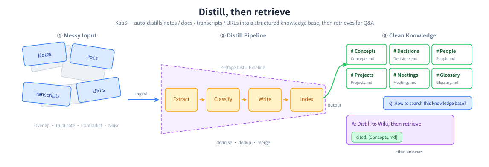
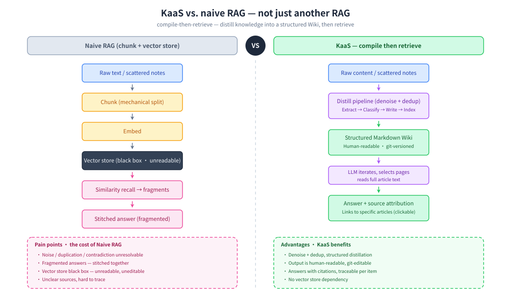
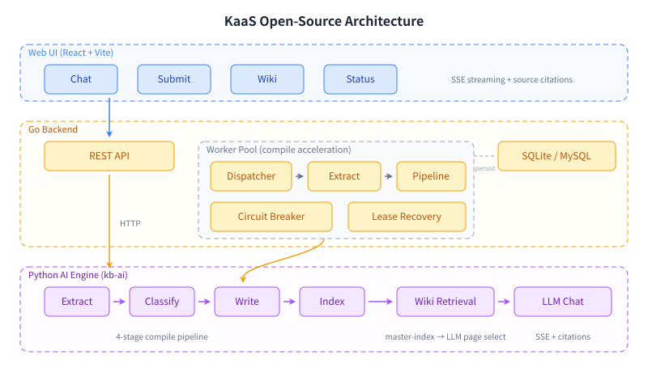

# KaaS — Knowledge as a Service

**English** · [中文](README.zh-CN.md)

Turn scattered notes, documents, and transcripts into a searchable, queryable personal Wiki — powered by LLM-driven knowledge compilation.



## Why We Built This

KaaS started as an internal tool. Our knowledge lived scattered across
documents, meetings, and email — and every time someone changed roles or left,
the context they'd built up walked out with them. New people spent weeks
piecing it back together.

A distillation pipeline fixed that. It compiles each person's scattered
material into a wiki tied to their _role_ rather than their identity — so when
someone moves on, the raw data goes but the distilled judgment stays for whoever
fills the seat next.

The payoff is the same either way: the organization stops re-answering the same
questions. That's what convinced us it was worth open-sourcing.

## What Makes This Different

Unlike typical RAG systems that chunk and embed raw text, KaaS **compiles** your content through a 4-phase LLM pipeline:

```
Raw Content → Extract → Classify → Write → Index → Structured Wiki
```

The result is human-readable Markdown articles — not a black-box vector store. You can read, edit, and git-manage your knowledge base.



## Quick Start with your AI agent

Already living in a coding agent (Claude Code, Codex, openclaw, …)? Skip Docker.
Copy this and paste it to your agent — it will install `kb-ai`, ask what to
distill, build the wiki, and wire up MCP so you can query it in any later session:

```
Set up KaaS to build a queryable knowledge base from my files.
Fetch https://raw.githubusercontent.com/bybit-exchange/kaas/main/docs/agent-quickstart.md
and follow it exactly.
```

Prefer a web UI, or want the full backend? Use the Docker path below.

## Quick Start

KaaS calls LLMs through any **OpenAI-compatible** API (OpenAI, DeepSeek, Ollama, vLLM, Azure OpenAI, etc.). Pick either method below:

### Option A: Docker

```bash
# Build the image
docker build -t kaas .

# Run
docker run -d --name kaas \
  -p 8080:8080 \
  -v ./data:/app/data \
  -e LLM_API_KEY=sk-xxx \
  -e LLM_BASE_URL=https://api.openai.com/v1 \
  -e LLM_MODEL=gpt-4o-mini \
  kaas
```

### Option B: CLI Install

```bash
# Install (Linux/macOS, amd64/arm64)
curl -fsSL https://raw.githubusercontent.com/bybit-exchange/kaas/main/install.sh | sh

# Start the service
export LLM_API_KEY="sk-xxx"                         # OpenAI-compatible API key
export LLM_BASE_URL="https://api.openai.com/v1"     # API endpoint
export LLM_MODEL="gpt-4o-mini"                      # Model name
kaas serve                                          # Default: http://localhost:8080
```

Supported platforms: Linux/macOS, amd64/arm64. Uninstall: `rm -rf ~/.local/share/kaas ~/.local/bin/kaas`.

---

> `LLM_BASE_URL` defaults to `https://api.openai.com/v1` and `LLM_MODEL` defaults to `gpt-4o-mini`.
> Change them to point at any OpenAI-compatible endpoint.

Open http://localhost:8080.

### Enable remote MCP (optional)

To let Claude Code or other MCP clients connect to the knowledge base:

```bash
docker run -d --name kaas \
  -p 8080:8080 \
  -v ./data:/app/data \
  -e LLM_API_KEY=sk-xxx \
  -e KAAS_MCP_ENABLED=true \
  -e KAAS_MCP_TOKEN=your-secret-token \
  kaas
```

MCP client URL: `http://<host>:8080/mcp`, Authorization: `Bearer your-secret-token`.

Or run locally:

```bash
make dev
```

## Architecture



| Layer | Tech | Purpose |
|-------|------|---------|
| Web UI | React + Vite + shadcn/ui | Chat, Submit, Wiki, Status |
| Backend | Go (net/http + go-zero/conf) | REST API, Worker Pool, Task Queue, MCP endpoint |
| AI Engine | Python (kb-ai daemon) | LLM Compile Pipeline, LLM-iterative retrieval, Chat |
| Storage | SQLite (default) / MySQL | Job queue, compile state |
| Retrieval | LLM iterative | master-index → LLM page selection → full-article context (no embeddings) |

The Go backend spawns the Python AI engine as a long-running daemon process, communicating via a multiplexed stdin/stdout protocol. A single Docker image bundles everything — no sidecar containers needed.

## Features

- **4-Phase Compile Pipeline**: Extract concepts/entities/decisions → Classify into articles → Write/merge Markdown → Update markdown indexes
- **Worker Acceleration**: Concurrent extract/pipeline workers, circuit breaker, lease recovery
- **Streaming Chat**: SSE streaming with source citations pointing back to wiki articles
- **Multiple Input Sources**: Paste text, upload files, or provide URLs
- **Incremental Compilation**: Only recompiles new/changed content
- **Git-Friendly Output**: All wiki articles are plain Markdown
- **MCP Access**: Query the compiled wiki from any MCP-capable coding agent via an `ask` tool

## MCP Access

Expose the compiled wiki to any [Model Context Protocol](https://modelcontextprotocol.io)
client (Claude Code, Codex, openclaw, …) through a single `ask` tool —
`ask(query, paths?, model?)` returns a cited Markdown answer grounded in the
wiki. Two transports:

**stdio** (local — the agent spawns the server, fully self-contained):

```bash
# The agent launches this; set KAAS_KB_DIR to the knowledge-base root and
# the LLM_* credentials in the environment.
kb-ai mcp                       # stdio is the default transport
```

```bash
# Claude Code:
claude mcp add kaas -- kb-ai mcp
```

For Codex / openclaw, add a stdio MCP server with command `kb-ai mcp` and env
`KAAS_KB_DIR` + `LLM_*`.

**streamable-http** (remote — published through the backend's `:8080` origin):

Run the container with `KAAS_MCP_ENABLED=true` (see [Quick Start](#quick-start)).
The backend exposes the MCP endpoint at `/mcp`. Point a remote agent at it:

```bash
# Claude Code:
claude mcp add --transport http kaas http://host:8080/mcp
```

Set `KAAS_MCP_TOKEN` to require `Authorization: Bearer <token>` on the HTTP
transport (off by default — local/intranet assumption). stdio has no network
surface and is unauthenticated.

## Configuration

All configuration lives in `etc/kaas.toml`. Copy and edit it:

```toml
[llm]
api_key = "sk-..."
base_url = "https://api.openai.com/v1"
model = "gpt-4o-mini"

[ai.mcp]
enabled = false          # set true to expose /mcp endpoint
token = ""               # bearer token for MCP auth (empty = no auth)
timeout_sec = 120        # tools/call timeout
```

With Docker, pass secrets as environment variables — they override the TOML at
startup:

| Env Var | Overrides | Default |
|---------|-----------|---------|
| `LLM_API_KEY` | `[llm] api_key` | _(empty)_ |
| `LLM_BASE_URL` | `[llm] base_url` | `https://api.openai.com/v1` |
| `LLM_MODEL` | `[llm] model` | `gpt-4o-mini` |
| `LLM_SUMMARIZE_MODEL` | `[llm] summarize_model` | same as `model` |
| `KAAS_MCP_ENABLED` | `[ai.mcp] enabled` | `false` |
| `KAAS_MCP_TOKEN` | `[ai.mcp] token` | _(empty = no auth)_ |
| `KAAS_WEB_DIR` | `[server] web_dir` | `/app/web/dist` (in Docker) |
| `KAAS_AI_MCP_URL` | `[ai] mcp_url` | _(deprecated — use `KAAS_MCP_ENABLED`)_ |

## Development

The quickest way to start all services locally:

```bash
# First time: create your local config (not tracked by git)
cp etc/kaas.toml etc/kaas-dev.toml
# Edit etc/kaas-dev.toml — set your LLM credentials:
#   [llm]
#   api_key = "sk-..."
#   base_url = "https://api.openai.com/v1"   # or your preferred endpoint
#   model = "gpt-4o-mini"

make dev
```

This launches the Go backend (which auto-spawns the Python AI daemon) and the Vite dev server together.

To run components individually:

```bash
# Backend (spawns Python daemon automatically)
go run ./cmd/kaas -f etc/kaas.toml

# Frontend (hot-reload)
cd web && pnpm dev

# MCP server (stdio — for local agent integration)
cd py && KAAS_KB_DIR=./data uv run kb-ai mcp

# Tests
make test
```

## Contributing

Contributions are welcome — see [CONTRIBUTING.md](CONTRIBUTING.md) for dev setup,
how to run the tests, and commit conventions.

## Acknowledgments

The core idea — compiling knowledge into a persistent, interlinked wiki that
compounds over time instead of re-deriving answers via RAG on each query — was
inspired by Andrej Karpathy's ["LLM Wiki"](https://gist.github.com/karpathy/442a6bf555914893e9891c11519de94f)
gist. Thanks for the clear articulation of the pattern.

## License

MIT — see [LICENSE](LICENSE).
