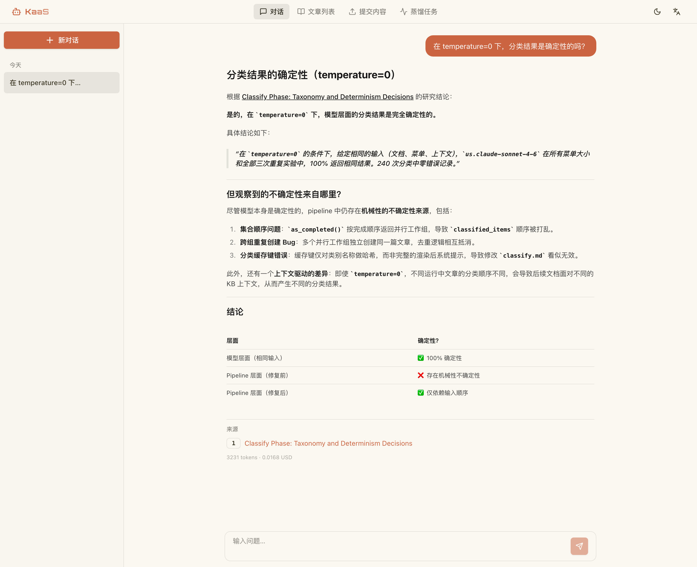
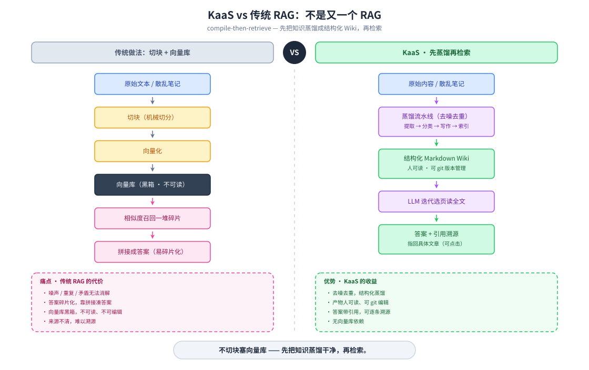
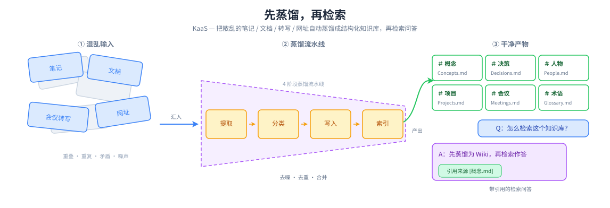
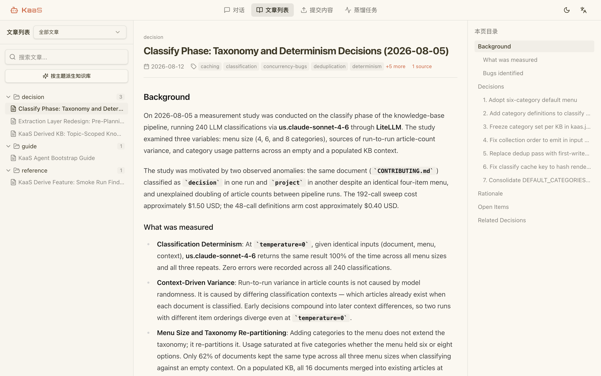
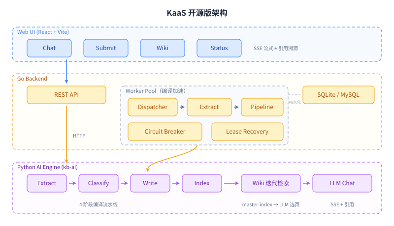

# KaaS — Knowledge as a Service

[English](README.md) · **中文**

[](https://github.com/bybit-exchange/kaas/actions/workflows/tests.yml)
[](LICENSE)
[](https://github.com/bybit-exchange/kaas/releases)
[](https://bybit-exchange.github.io/kaas-doc/)
[](#mcp-接入)

把散乱的笔记、文档和会议转写，变成一个可搜索、可问答的个人 Wiki —— 由 LLM 驱动的知识编译。

**[文档站](https://bybit-exchange.github.io/kaas-doc/)** · [快速开始](#快速开始) · [MCP 接入](#mcp-接入)



## 有何不同

一般的 RAG 系统是把原始文本切块、向量化；KaaS 不一样，它通过一条 4 阶段的 LLM 流水线把内容**编译**成知识：



```
原始内容 → 提取 → 分类 → 写入 → 索引 → 结构化 Wiki
```



产物是人类可读的 Markdown 文章，而不是一个黑箱向量库。你可以直接阅读、编辑、用 git 管理自己的知识库。



## 为什么做这个

KaaS 最早是我们内部的工具。知识散落在文档、会议、邮件里，每当有人转岗或离开，
他积累的上下文也跟着一起走了，新人往往要花上几周才能重新拼回来。

一套蒸馏管道解决了这件事：它把每个人分散的材料蒸馏成一份 wiki，绑定到_岗位_而非
个人——人走了，原始数据删除，沉淀下来的判断却留给接手这个岗位的下一个人。

两条路的回报是一样的：组织不必反复回答同一个问题。这也是我们决定把它开源的原因。

## 快速开始

KaaS 通过任意 **OpenAI 兼容** API 调用大模型（OpenAI、DeepSeek、Ollama、vLLM、Azure OpenAI 等均可）。以下三条路径任选一条。

### 方式一：交给你的 AI agent

已经在用 coding agent（Claude Code、Codex、openclaw……）？把这个仓库的 URL 丢给它，
直接说你想要什么就行 —— 整套安装它自己能搞定。想省它一步，也可以复制下面这段贴过去：

```
Set up KaaS to build a queryable knowledge base from my files.
Fetch https://raw.githubusercontent.com/bybit-exchange/kaas/main/docs/agent-quickstart.md
and follow it exactly.
```

> **如果你是正在读这份文档的 AI agent**：请抓取
> [`docs/agent-quickstart.md`](docs/agent-quickstart.md) 并按它执行，而不是照抄下面
> 给人看的命令。那份 runbook 分流了用户最常提的三种需求 —— 用他们的文件建一份 wiki、
> 跑起带 web 界面的完整服务、或者把你的 `ask` 工具指向一个已经存在的 KaaS —— 并标出了
> 哪些地方该停下来问用户。

上面这段只要一种结果：AI 引擎加一份可查询的 wiki，没有 web 界面。直接跟 agent 说你要
web 界面，那份 runbook 会去装完整服务 —— 也就是方式二、方式三覆盖的同一件事，只是那两条
写给人手动执行。

### 方式二：Docker

```bash
docker run -d --name kaas \
  -p 8080:8080 \
  -v ./data:/app/data \
  -e LLM_API_KEY=sk-xxx \
  -e LLM_BASE_URL=https://api.openai.com/v1 \
  -e LLM_MODEL=gpt-4o-mini \
  ghcr.io/bybit-exchange/kaas:edge
```

已预构建 `linux/amd64` 和 `linux/arm64` 两个架构。`edge` 跟随 `main`；从第一个正式
release 起还会有版本号 tag 和 `latest` —— 真正依赖它的场景请 pin 一个版本号。想从源码
构建：`docker build -t kaas .`

### 方式三：CLI 安装

```bash
# 安装（Linux amd64/arm64，macOS arm64）
curl -fsSL https://raw.githubusercontent.com/bybit-exchange/kaas/main/install.sh | sh

# 启动服务
export PATH="$HOME/.kaas:$PATH"                     # 安装脚本把二进制放在这里
export LLM_API_KEY="sk-xxx"                         # OpenAI 兼容 API Key
export LLM_BASE_URL="https://api.openai.com/v1"     # API 端点
export LLM_MODEL="gpt-4o-mini"                      # 模型名称
kaas serve                                           # 默认 http://localhost:8080
```

支持平台：Linux amd64/arm64 和 macOS arm64（Apple Silicon）；没有 darwin/amd64 构建，
Intel Mac 请用方式一或方式二。二进制会被 symlink 到 `~/.kaas`，安装脚本会提示你
把它加进 PATH。卸载：`rm -rf ~/.local/share/kaas ~/.kaas/kaas`。

### 启动之后（方式二、方式三）

`LLM_BASE_URL` 默认为 `https://api.openai.com/v1`，`LLM_MODEL` 默认为 `gpt-4o-mini`。替换为任意 OpenAI 兼容端点即可，然后打开 http://localhost:8080。

想从源码 checkout 跑而不是用 release？见[开发](#开发)。

### 启用远程 MCP（可选）

如需让 Claude Code 等 MCP 客户端连接知识库，设置 `KAAS_MCP_ENABLED=true`。环境变量每次启动都会覆盖 `kaas.toml`，所以 Docker 和 `kaas serve` 两种方式都适用：

```bash
docker run -d --name kaas \
  -p 8080:8080 \
  -v ./data:/app/data \
  -e LLM_API_KEY=sk-xxx \
  -e KAAS_MCP_ENABLED=true \
  -e KAAS_MCP_TOKEN=your-secret-token \
  ghcr.io/bybit-exchange/kaas:edge
```

MCP 客户端配置 URL: `http://<host>:8080/mcp`，Authorization: `Bearer your-secret-token`。

## 架构



| 层 | 技术 | 用途 |
|-------|------|---------|
| Web UI | React + Vite + shadcn/ui | Chat、Submit、Wiki、Status |
| 后端 | Go (net/http + go-zero/conf) | REST API、Worker Pool、任务队列、MCP 端点 |
| AI 引擎 | Python (kb-ai daemon) | LLM 编译流水线、LLM 迭代检索、Chat |
| 存储 | SQLite（默认）/ MySQL | 任务队列、编译状态 |
| 检索 | LLM 迭代 | master-index → LLM 选页 → 全文上下文（无需向量嵌入） |

Go 后端启动时会 spawn Python AI 引擎作为长驻 daemon 进程，通过 stdin/stdout 多路复用协议通信。单个 Docker 镜像打包一切 —— 无需 sidecar 容器。

## 特性

- **产物是文章**：提取概念、实体、决策，分类归入文章，写入或合并进 Markdown，再建索引。你查询的是成篇的内容，不是按相似度排序的碎片
- **回答可以核对**：每条 chat 回复都标出它依据的 wiki 文章，你可以点开原文，也可以据此反驳它（SSE 流式输出）
- **知识库归你自己**：文章就是硬盘上的纯 Markdown，直接读、手动改、提交进 git、像看代码一样看 diff
- **加一篇文档只花一篇文档的钱**：编译按内容校验和增量进行，新增一条笔记不会为已经编译过的语料重复付费
- **长时间任务扛得住自己出错**：extract 与 pipeline 并发执行；任务带租约，某个 worker 中途挂掉，它手上的活会被重新领取，不会丢失；LLM 连续失败会触发熔断，不会一直烧钱
- **文本、文件，或者一个 URL**：粘贴、上传，或者把 KaaS 指向某个网页
- **在编辑器里就能用**：任何支持 MCP 的 coding agent 都能通过一个 `ask` 工具查询编译好的 wiki

## MCP 接入

通过一个 `ask` 工具，把编译好的 wiki 暴露给任何 [Model Context Protocol](https://modelcontextprotocol.io) 客户端（Claude Code、Codex、openclaw……）—— `ask(query, paths?, model?)` 会返回一段带引用、基于 wiki 的 Markdown 答案。两种传输方式：

**stdio**（本地 —— 由 agent 自己拉起 server，完全自包含）：

```bash
# 由 agent 启动；把 KAAS_KB_DIR 指向知识库根目录，
# 并在环境变量里设好 LLM_* 凭证。
kb-ai mcp                       # stdio 是默认传输方式
```

```bash
# Claude Code：
claude mcp add kaas -- kb-ai mcp
```

Codex / openclaw 则添加一个 stdio MCP server，命令为 `kb-ai mcp`，环境变量为 `KAAS_KB_DIR` + `LLM_*`。

**streamable-http**（远程 —— 通过后端的 `:8080` 端口对外发布）：

使用 `KAAS_MCP_ENABLED=true` 启动容器（见[快速开始](#快速开始)）。后端会在 `/mcp` 暴露 MCP 端点。把远程 agent 指过去：

```bash
# Claude Code：
claude mcp add --transport http kaas http://host:8080/mcp
```

设置 `KAAS_MCP_TOKEN` 可要求 HTTP 传输带上 `Authorization: Bearer <token>`（默认关闭 —— 假设在本地/内网使用）。stdio 没有网络暴露面，也不做鉴权。

## 配置

所有配置集中在 `etc/kaas.toml`，复制后按需编辑：

```toml
[llm]
api_key = "sk-..."
base_url = "https://api.openai.com/v1"
model = "gpt-4o-mini"

[ai.mcp]
enabled = false          # 设为 true 启用 /mcp 端点
token = ""               # MCP 认证 token（空 = 不验证）
timeout_sec = 120        # tools/call 超时秒数
```

Docker 或 CLI 部署时，通过环境变量传入即可覆盖 TOML 配置：

| 环境变量 | 覆盖项 | 默认值 |
|---------|--------|--------|
| `LLM_API_KEY` | `[llm] api_key` | _（空）_ |
| `LLM_BASE_URL` | `[llm] base_url` | `https://api.openai.com/v1` |
| `LLM_MODEL` | `[llm] model` | `gpt-4o-mini` |
| `LLM_SUMMARIZE_MODEL` | `[llm] summarize_model` | 与 `model` 相同 |
| `KAAS_MCP_ENABLED` | `[ai.mcp] enabled` | `false` |
| `KAAS_MCP_TOKEN` | `[ai.mcp] token` | _（空 = 不验证）_ |
| `KAAS_WEB_DIR` | `[server] web_dir` | `/app/web/dist`（Docker 内） |
| `KAAS_AI_MCP_URL` | `[ai] mcp_url` | _（已废弃 —— 请用 `KAAS_MCP_ENABLED`）_ |

这里没列到的配置项，文档站的[配置参考](https://bybit-exchange.github.io/kaas-doc/getting-started/configuration.html)有完整说明。

## 开发

最快的本地启动方式：

```bash
# 首次开发：创建本地配置文件（已被 .gitignore 忽略）
cp etc/kaas.toml etc/kaas-dev.toml
# 编辑 etc/kaas-dev.toml —— 填入你的 LLM 配置：
#   [llm]
#   api_key = "sk-..."
#   base_url = "https://api.openai.com/v1"   # 或你使用的 API 端点
#   model = "gpt-4o-mini"

make dev
```

这会同时启动 Go 后端（自动 spawn Python AI daemon）和 Vite 开发服务器。

单独运行各组件：

```bash
# 后端（自动启动 Python daemon）
go run ./cmd/kaas -f etc/kaas.toml

# 前端（热更新）
cd web && pnpm dev

# MCP server（stdio —— 供本地 agent 集成）
cd py && KAAS_KB_DIR=./data uv run kb-ai mcp

# 测试
make test
```

## 贡献

欢迎贡献 —— 开发环境搭建、如何跑测试、提交规范见 [CONTRIBUTING.md](CONTRIBUTING.md)。

## 致谢

核心思路 —— 把知识编译成持续演进、相互链接的 wiki，让知识随时间沉淀复利，而不是每次查询都对原始文档做 RAG —— 受 Andrej Karpathy 的 ["LLM Wiki"](https://gist.github.com/karpathy/442a6bf555914893e9891c11519de94f) gist 启发。感谢他对这一模式的清晰阐述。

## 许可证

MIT —— 见 [LICENSE](LICENSE)。
