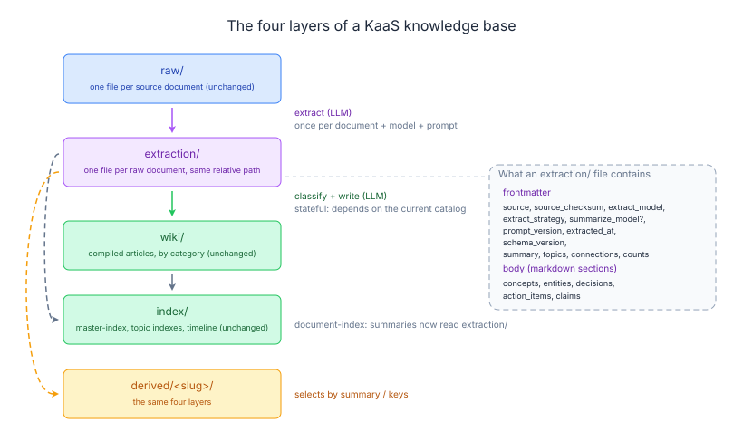

# Make extraction a first-class layer

Date: 2026-08-07
Slug: `extraction-layer`
Status: aligned. O1–O7 settled in the first alignment pass; S1 and Q1–Q10 settled
in the second and recorded with their reasoning in
[alignment-questions.md](alignment-questions.md). No open questions.

## Background

A KaaS knowledge base already has four stages, but only three of them have a
name on disk. `raw/` holds documents, `wiki/` holds compiled articles, `index/`
holds navigation. The fourth stage, the per-document extraction that everything
downstream is built from, lives in `.extract-cache/` under a name that says
"disposable".

It isn't disposable. The write phase composes articles from extractions and
never re-reads raw:

```python
# py/src/kb_ai/commands/pipeline/_phase_write.py:53
all_sources = [(ref, ext) for _ch, ref, ext, _action, _det in ops]
combined, merge_refs = _combine_extractions(all_sources)
new_content = merge_into_article(art_path, old_content, combined, ", ".join(merge_refs), ...)
```

And document-level topic selection reads extraction summaries: `_document_summary`
(`py/src/kb_ai/storage/index.py:140`) tries the document's own frontmatter, then
`store.load_extract_cache(...)["summary"]`, then the first prose paragraph.

So extraction is the source of truth for article prose and for document
selection, while being stored as a cache. Three concrete costs follow.

**1. The two ingestion paths disagree about persisting it.** The CLI path caches
extractions (`commands/compile.py:133` reads, `:146` writes). The Go worker path
does not: `_handle_extract` (`py/src/kb_ai/server_daemon.py:117`) returns the
extraction in its response and writes nothing, the bridge carries it as an opaque
blob (`internal/bridge/api.go:42`), and the worker passes it straight into the
pipeline in memory (`internal/worker/worker.go:123`). A document submitted
through the HTTP API or web UI therefore has **no persisted extraction at all**.
Nothing fails at submit time; the consequences show up later. Such a document
falls to the first-paragraph branch of `_document_summary`, so derive's document
catalog sees a materially worse summary for it than for a CLI-ingested document.
`derive`'s `copy_documents` finds nothing to copy and the derived compile re-pays
extract (`derive/_layout.py:195`). Re-running the pipeline re-pays extract where
the CLI would not. Selection quality ends up depending on the ingestion route.

**2. There is no provenance in the file, so staleness is undetectable.**
`extraction_to_dict` (`core/extract.py:77`) emits exactly eight payload fields —
`summary`, `concepts`, `entities`, `decisions`, `action_items`, `claims`,
`topics`, `connections` — and nothing about where they came from. The filename is
a content checksum of the source, which makes *text* staleness impossible but
says nothing about model or prompt. Change the extract model, or edit
`prompts/defaults/extract.md` (overridable per-deployment via `KAAS_PROMPTS_DIR`,
`core/extract.py:85`), and every existing entry is silently reused. The code
already concedes this in `derive/_layout.py:168-170`: *"the cache key carries no
model or prompt version, so compiling a derived KB with a different model than
the source reuses the other model's extractions."*

**3. Reads reconstruct what could just be read.** To get one document's summary
today you read the document, hash its bytes, and look the hash up in a cache
directory, with two fallbacks for when that misses. The summary you get was
written for extraction rather than for a catalog line: its median length is 361
chars against the catalog's `SUMMARY_MAX_CHARS = 200`, so most entries are
clipped (`storage/index.py:156-157`).

This spec proposes no new pipeline stage. It gives the existing fourth stage a
name, a stable filename, and a header:



The filenames in `raw/` and `extraction/` are identical — for example
`window-2026-06__docs__2026-06-01-abf-day-1.md` sits at that path in both trees.

Everything not on that diagram stays exactly as it is: `.classify-cache/`
(correctly a cache — its key includes the catalog state), `.compile-state.json`,
`.compile.log`, `kaas.json`, `derived/*/manifest.json`.

## Goals

1. Four named layers, one job each, so a reader can point at a directory and say
   what it holds without reading code: `raw/` = what came in, `extraction/` =
   what we understood about each document, `wiki/` = what we composed, `index/` =
   how to find it.
2. `extraction/` is 1:1 with `raw/`, at the same relative path, so the mapping is
   readable off the filename with no hashing step.
3. Every extraction file carries its own provenance, making "is this stale, and
   why" a field comparison instead of an unknown.
4. Both ingestion paths — CLI `compile` and HTTP/UI submit through the Go worker
   — produce the same extraction layer, so downstream quality does not depend on
   the ingestion route.
5. Read paths get shorter: the document catalog reads a summary out of a file it
   can name instead of hashing the document and looking the hash up in a cache
   (E1), and derive copies a file it can name instead of a hash it has to
   recompute.
6. Editing an extraction prompt costs one extraction pass, not one full
   recompile. Prompt tuning is the workflow this layer exists to serve, so its
   price has to be bounded and predictable.

## Non-Goals

- Removing or restructuring `index/`. All four index files stay, and
  `document-index.md` keeps its current format; only how it is computed changes.
- Changing the extract, classify or merge prompts, or the article format.
- Migrating `.extract-cache/` (S1). The old cache is abandoned in place, not
  converted. There is no migration command, no auto-migration, and no
  grandfathered provenance.
- Compatibility with knowledge bases produced before this change, in either
  direction. Pre-change derived KBs keep working for the checks that do not read
  extractions (F5) and do not for the ones that do (F3).
- Making a compile reproducible from `extraction/` alone. Classify is stateful by
  design — its key is `checksum-articlesHash-categoriesHash`
  (`core/classify.py:268`) because the same document should route differently
  once the wiki around it has moved. This spec does not flatten that away.
- Switching `derive` from copying documents to referencing them. That is a real
  simplification and a separate decision: today's copy is deliberate
  (*"Copied, not symlinked, so deleting the source KB cannot invalidate the
  derived one"*, `derive/_layout.py:165-166`) and referencing conflicts with the
  cross-KB, read-only source case `build_document_catalog` is written for.
- Garbage-collecting orphaned cache files, or changing `.classify-cache/` at all.
- Giving the write phase its own provenance. Extraction gets provenance here and
  classify already hashes its rendered prompt (`core/classify.py:88-100`), but
  editing `merge-rewrite.md` or `merge-diff.md` still invalidates nothing,
  because the write phase is gated only by `.compile-state.json`. Named as a
  known gap so it is not read as an oversight.

## User stories / scenarios

**S1 — A newcomer reads the layout.** Someone opens a KB directory and can name
every layer without opening the source. `extraction/` sits next to `raw/` with
matching filenames; the fact that article prose comes from it, not from `raw/`,
is visible rather than inferred.

**S2 — A document ingested through the web UI is selected as well as one ingested
through the CLI.** An operator pastes a meeting note into the UI, then derives a
topic KB. The document is judged on its extraction summary, exactly as a
CLI-compiled document is, because the worker path now persists the extraction it
already paid for.

**S3 — The extract prompt changes.** A maintainer edits
`prompts/defaults/extract.md`. The next compile reports that every extraction is
now stale, re-extracts them, and stops there — the wiki is not rewritten, and the
report says how far behind it now is. With `--extract-only` the maintainer can
re-extract and read the new files in an editor before paying for the write phase
at all.

**S4 — A bad extraction is inspected and patched.** An article reads wrong. The
maintainer opens the extraction file for the document it came from, sees the
summary and the decisions list that produced it, and can fix or delete that one
file to force a re-extract — without guessing at a checksum-named cache entry.

## Acceptance criteria

### A. Layout and naming

- A1. Extractions live in `<kb>/extraction/`, a normal (non-dot) directory.
- A2. For a raw document at `raw/<rel>`, its extraction is at
  `extraction/<rel>` — the relative path is mirrored exactly, including
  intermediate directories and the `.md` extension. `raw/` is scanned with
  `rglob("*.md")` (`storage/store.py:114`), so nested paths are possible and must
  round-trip. There is no suffix arithmetic, which is what made the double-suffix
  bug fixed in `eba18d0` possible.
- A3. `.md` under `extraction/` collides with nothing: every existing markdown
  scan is rooted at `wiki/` (`storage/index.py:255`, `core/people.py:165`,
  `pipeline/_entry.py:118`, `internal/api/derive.go:259`, `internal/api/wiki.go:237`)
  or at `raw/` (`storage/store.py:114`). Nothing walks the KB root, and this spec
  does not add anything that does.
- A4. Path→path mapping is one function in `KBStore`, used by every reader and
  writer; no caller builds the path itself.
- A5. `extraction/` obeys the same scan rules as `raw/`: dotfiles skipped, and
  nothing under a `_skipped/` segment is read or written
  (`storage/store.py:107-122`).
- A6. Exactly one extraction file per raw document at any time. Re-extracting
  overwrites in place; it does not accumulate a second file.

### B. File contents and provenance

- B1. An extraction file is markdown with YAML frontmatter. The frontmatter
  carries provenance — `source` (the `raw/<rel>` path), `source_checksum` (the
  same 16-hex prefix `_compute_checksum` produces), `extract_model`,
  `extract_strategy`, `summarize_model` (only on the summarize path, see B15),
  `prompt_version`, `extracted_at`, `schema_version` — plus the three payload
  fields that are flat enough to belong there: `summary`, `topics`,
  `connections`.
- B2. The body carries the five object-list payload fields as markdown sections,
  in this fixed order: `concepts`, `entities`, `decisions`, `action_items`,
  `claims`. Each section's content is `yaml.safe_dump` of that field's list, so
  every field of every item is an explicit labelled value and never implied by
  styling. Section order is pinned rather than derived from dict iteration,
  because it is part of C3's byte-identity.

  ```markdown
  ---
  source: raw/window-2026-06__meetings__2026-06-04-video-meetingcc.md
  source_checksum: 0123456789abcdef
  extract_model: claude-sonnet-4-6
  extract_strategy: chunked
  prompt_version: a1b2c3d4e5f6
  extracted_at: '2026-08-07T11:22:33+00:00'
  schema_version: 1
  summary: ...
  topics: [...]
  connections: [...]
  counts:
    action_items: 2
    claims: 5
    ...
  ---

  ## Claims

  - claim: ...
    surprising: false
  ```

- B3. The heading for a section is a pure function of the field name —
  `action_items` → `.replace("_", " ").title()` → `Action Items`, reversed by
  `.lower().replace(" ", "_")`. All five field names are lowercase with
  underscores, so the round-trip is exact and there is no mapping table to keep
  in sync.
- B3a. A heading is recognised **only at column 0** — `line.startswith("## ")`,
  never `line.strip().startswith("## ")`. This is load-bearing rather than stylistic.
  `safe_dump` renders a string that contains a newline as a *multi-line*
  single-quoted scalar, whose continuation lines are real physical lines indented
  by at least two spaces:

  ```
  - claim: '决议如下

      ## Entities

      后半段'
  ```

  Measured against a `strip()`-based scanner: the file yields a phantom
  `entities` section and the `claims` section becomes an unterminated quoted
  scalar, so `safe_load` raises `ScannerError`. B9 then treats the extraction as
  absent and the document re-extracts on every compile without ever composing —
  the exact permanent-restale state C10 exists to prevent. PyYAML always indents
  a continuation inside a block sequence, so a column-0 test round-trips the same
  fixture exactly. The spec's measurement of 0 embedded newlines across 32,319
  string values (O1) says this is rare in today's output; it does not say the next
  prompt edit cannot produce it.
- B4. The frontmatter also carries `counts`, the per-section item count. A parse
  whose section counts disagree with `counts` is a corrupt file (B9), not an
  empty one. With B3 this makes `counts` verification a single dict comparison.
  It is also what removes markdown's failure mode: without it, a mistyped
  `## Claims` heading silently yields zero claims and a thinner article with no
  error anywhere.
- B5. Both the frontmatter and every body section are written with
  `yaml.safe_dump(..., allow_unicode=True, default_flow_style=False,
  width=10**6)`, matching `core/people.py:117`. `allow_unicode` keeps CJK
  unescaped — the body is where the CJK-dense values live, such as a concept's
  `definition` — and the width bound stops PyYAML folding a long value, which
  corrupts silently. Quoting and escaping *within* a scalar are therefore
  PyYAML's responsibility, not hand-written: that is what makes H2's `"`, `: `,
  `no` and CJK fixtures pass by construction.

  What `safe_dump` does **not** give for free is one physical line per value. A
  newline inside a value becomes a multi-line quoted scalar, and its continuation
  lines then compete with the two line-oriented delimiters this format relies on:
  the `## ` heading (B3a) and the frontmatter `---` (B6). Both are closed
  explicitly rather than assumed away.
- B6. Reading reuses `split_frontmatter` (`py/src/kb_ai/_frontmatter.py`) rather
  than adding a second splitter. Its docstring records the
  `content.split("---", 2)` bug that commit `eba18d0` fixed, and that bug is
  exactly what a new splitter would risk reintroducing.
- B6a. `split_frontmatter` closes the delimiter on `line.rstrip() == "---"`
  instead of today's `line.strip() == "---"` (`_frontmatter.py:25`). With
  `strip()`, a `summary` containing a line that is exactly `---` dumps as a
  continuation line `  ---`, which strips to the delimiter and truncates the
  block mid-scalar; measured, `safe_load` then raises `ScannerError` and every key
  after the truncation point is lost. `rstrip()` still tolerates trailing
  whitespace on a real delimiter — the only case `strip()` was buying — while
  rejecting an indented one, which is never a legitimate delimiter. This is a
  change to shared code, taken deliberately: the same latent truncation applies to
  today's wiki-article and raw-document readers, and B6 requires this layer to
  depend on that splitter. It needs the existing `_frontmatter` tests green plus
  one new case.

  Given B5, B6 and B6a, the serializer/parser pair O1 accepted as a cost reduces
  to column-0 heading location plus `safe_load`.
- B7. Because everything selection needs is in the frontmatter, a reader doing
  catalog or topic-filter work parses the frontmatter only and never the body.
- B8. Writes are atomic — temp file plus `os.replace`, matching
  `save_compile_state` (`storage/store.py:301`) and `write_manifest`
  (`derive/_layout.py:203`) — so a crash mid-write cannot leave a file whose
  header disagrees with its payload.
- B9. A missing, unparseable or count-mismatched extraction file is treated as
  absent, never as empty-but-valid, and the reason is reported. It must not
  silently produce an article with no content.
- B10. An extraction is **stale** when any of `source_checksum`, `extract_model`,
  `extract_strategy`, `prompt_version` disagrees with the current source document
  and configuration, plus `summarize_model` when the recorded `extract_strategy`
  is `summarize`. Staleness is a plain field comparison with no special values and
  no exemptions: no LLM call, no network, no `unknown` tier. The comparison set is
  the fields the recorded strategy actually used — four for `chunked`, five for
  `summarize` — so a `summarize_model` change cannot mark a chunked extraction
  stale over a model that never touched it.
- B11. `prompt_version` is a 12-hex-digit hash over the extraction stage's prompt
  set **as it currently renders**, with no reference to which prompts a given run
  used. Hashed input: the loaded content of `extract`, `merge-summaries` and
  `summarize`, plus the five rendered `extract-types` variants —
  `_render_type_split_prompt` called for each `(k, group)` enumerated from
  `TYPE_SPLIT_GROUPS_K2` and `TYPE_SPLIT_GROUPS_K3` themselves, so nothing is
  mirrored. Name and content are framed with a NUL separator and a length prefix,
  so a trailing newline cannot collide with the next name.

  ```python
  EXTRACT_STAGE_PROMPTS = ("extract", "extract-types", "merge-summaries", "summarize")
  ```

  Hashing the *renderings* rather than `extract-types.md` verbatim is what makes
  changes to `TYPE_SPLIT_GROUPS_K2/K3` and `_FIELD_JSON_SCHEMAS`
  (`core/extract.py:95-115`) visible. Those are code constants, but they change
  the text actually sent to the model, and the renderer plus both tables already
  exist, so closing the blind spot costs nothing.

  This is the convention `classify_inputs_hash` already established
  (`core/classify.py:88-100`), whose docstring records that the previous
  categories-only hash had precisely the silent-reuse bug this field exists to
  prevent: *"a prompt-only edit silently kept serving classifications produced by
  the previous prompt."*
- B12. `prompt_version` is computed once per process, memoized, before the first
  extraction. The registry caches lazily per name (`prompts/__init__.py:23`,
  `registry.py:48-53`), so a long-lived daemon can hold `extract` from before a
  prompt edit and `summarize` from after it. Without B12 the value would depend on
  load order rather than only on time — two documents extracted minutes apart in
  one daemon could record different hashes with no code change, and H3's
  byte-identity assertion would fail spuriously inside that window. Computing it
  once pins all four names into the cache together, makes `prompt_version` a
  per-process constant, and makes "restart the daemon after editing prompts" an
  exact rule rather than a hedge.
- B13. Computing `prompt_version` must never fall back to "fresh". A missing or
  invalid prompt file makes `load_prompt` raise `NoActivePromptError`
  (`registry.py:88`); a read path must catch it and report the reason in B9's
  style rather than crashing or assuming freshness.
- B14. `load_prompt` asserts its argument is in `EXTRACT_STAGE_PROMPTS`, so adding
  a fifth extraction prompt without listing it fails at first use instead of
  silently narrowing the hash.
- B15. `extract_strategy` records the strategy that ran, not the one requested.
  `_handle_extract` accepts `chunked`, `summarize` and `auto`, and `auto` routes
  on chunk count — `len(chunks) >= 3` goes to summarize
  (`server_daemon.py:152-160`). Recording `auto` would make the field useless, so
  it records the resolved value. Chunk size and the type-split K stay out of the
  frontmatter deliberately: these fields exist to be read and acted on, and an
  opaque config hash serves neither.

  The summarize path is driven by **two** models, so one `extract_model` field
  cannot describe it: `extract_knowledge_summarized(chunks, meta, summarize_model,
  model)` (`server_daemon.py:151`) uses `summarize_model` for the per-chunk pass
  and for `merge_summaries_l2`, and `model` only for the phase-2 extraction. That
  first model is resolved from `LLM_SUMMARIZE_MODEL` or `LLM_MODEL`
  (`server_daemon.py:134`), independently of the second. Without recording it, two
  extractions can agree on `extract_model`, `extract_strategy` and
  `prompt_version` and still be products of different models — the same defect O3a
  caught for the strategy itself. `summarize_model` is therefore recorded on the
  summarize path and omitted on the chunked path, where no such call happens.
- B16. `extracted_at` is UTC with an offset, `timespec="seconds"`, from one
  `_now_iso()` helper. Neither half of that is inherited whole from an existing
  call site: `core/classify.py:71` is UTC-aware but has no `timespec`, and
  `derive/__init__.py:230` has `timespec="seconds"` but is naive local. What is
  rejected is the naive local `datetime.now().isoformat()` used by
  `commands/compile.py:269` and `derive/__init__.py:230`. Derived KBs get handed to
  other machines (F4), and `derive/_layout.py` copies with `shutil.copyfile`,
  which does not preserve mtime the way `copy2` would. The field in the file is
  the only durable answer to "when was this extracted", and a naive local
  timestamp is misleading once it has moved. `extracted_at` is not a function
  parameter; H3 monkeypatches `_now_iso`, because a production parameter whose
  only real caller is a test is test scaffolding in the API.
- B17. `topics` and `connections` are sorted at serialisation. Both are built with
  `list(set(...))` — `core/extract.py:727-728` for a multi-chunk document and
  `_combine_extractions` (`:748-749`) for a merge — and Python randomises string
  hashing per process, so the same `ExtractionResult` content yields a different
  element order in every run. Verified: three subprocesses over the same five tags
  produced three different orders. C2 is not affected, being scoped to one
  `ExtractionResult`, and H3 runs in one process. What sorting buys is that
  re-extracting an unchanged document produces the same two lines as before, so a
  diff between two extraction files shows only what actually changed — which is
  what makes S4's "open the file and see what produced this" workable, and what
  the git-committed-KB case in Open questions would otherwise turn into noise.

### C. Write-path parity and failure semantics

- C1. One `persist()` function in the extraction module serialises and writes an
  extraction file. The CLI compile path calls it where it writes
  `.extract-cache/` today (`commands/compile.py:146`); the daemon calls the same
  function. There is no second serializer anywhere.
- C2. The same document ingested by either route yields a **byte-identical**
  extraction file, given the same model and prompt version. An
  extraction payload is LLM output, so two real runs never agree byte for byte
  anyway. C2 is a property of the *serializer*, not of extraction, and its test
  is necessarily a stubbed-LLM one. What it proves is that there is one serializer
  on one code path. `extracted_at` is the only non-deterministic field (B16);
  everything else in the file is fixed given one `ExtractionResult`.
- C3. **The Python daemon persists it**, at the extract hop, before the pipeline
  stage runs. Writing on the Go side would mean a second markdown serializer in
  Go, which turns C2 from a structural property into a coincidence between two
  implementations — and with B5 putting the body on `safe_dump` too, that
  implementation would have to reproduce PyYAML's escaping decisions, not just the
  layout.
- C4. `bridge.ExtractRequest` gains `kb_dir`, `source` and `model`. The first two
  are already in the worker's hand — `PipelineRequest.KBDir`
  (`internal/bridge/api.go:57`) and `PipelineItem.SourceRef` (`:52`) — and only
  need to reach the extract hop. The two `kb_dir` values must be the same value —
  both come from `w.cfg.KBDir` today, and carrying it twice invites someone to
  change one of them later.

  `model` is added because without it the two routes record different
  `extract_model` values by construction, not by misconfiguration.
  `ExtractRequest` carries only `Content`, `Model`, `Strategy` and
  `SummarizeModel` (`:33-36`) and the worker fills just two of them —
  `Content` and `SummarizeModel` (`internal/worker/worker.go:94-97`) — so
  `_handle_extract` falls back to its literal default `claude-sonnet-4-6`
  (`server_daemon.py:132`) and never sees the deployment's configured
  `LLM.Config.Model`, whose own default is `gpt-4o-mini`
  (`internal/config/config.go:106`). The model argument is authoritative once it
  reaches the API (`llm/_completion.py:65` passes it straight through), so the
  recorded value is honest either way. It is just not the same value the CLI records.
  On any deployment that sets a non-default extract model, every UI-ingested
  extraction is then stale by B10 on the next CLI compile and re-extracted once,
  per document, forever. C4 already opens this struct; adding a third field is the
  same edit.
- C5. The worker sends `source` as a path relative to the KB root, computed once
  with `filepath.Rel(cfg.KBDir, task.RawPath)` and fed to both
  `ExtractRequest.Source` and `PipelineItem.SourceRef`. This also fixes a
  pre-existing bug: `internal/api/submit.go:60` builds an absolute `rawPath` from
  an already-absolute `KBDir`, and `internal/worker/worker.go:125` forwards it
  verbatim as `SourceRef`, so documents ingested through the HTTP API or web UI
  produce articles whose `sources:` entries are absolute filesystem paths while
  CLI-compiled articles carry `raw/<rel>`. Measured by parsing the frontmatter of
  every article with `split_frontmatter` and counting `sources` entries: 153 across
  the reference KB's 78 articles, and 314 across the seven derived KBs, with 0
  absolute paths anywhere. So no existing artifact needs read-side tolerance for
  both forms.
- C6. The daemon reads `extraction/<rel>` before calling the model and returns it
  unchanged when it exists and all of B10's fields match. This is what makes a
  retry free. Retries are real — `MaxAttempts` plus `Nack` returns a task to
  pending (`internal/queue/queue_test.go:79-92`,
  `internal/worker/worker_test.go:172,186-189`), and `w.fail` is a `Nack`
  (`internal/worker/worker.go:147-154`) — so today a pipeline failure with an
  attempt left re-runs the whole task and pays for extraction a second time. This
  does not violate O4: it is not extracting.
- C7. A write failure fails the task. The daemon returns an error, the worker
  calls `w.fail` with the reason, and there is no "extracted but not persisted"
  state. The alternative would need a marker added to `ExtractResponse` — which
  carries only `Extraction` and `Cost` (`internal/bridge/api.go:40-43`) — plus a
  channel to surface a warning on the task record, and `Warnings []string` exists
  nowhere but the *derive* response (`:168`). One code path against one new
  half-success protocol. Accepted cost: real money on a retry after a disk error,
  which C6 cannot rescue because a failed write leaves nothing to reuse.
- C8. The write is not retried. B8's atomic temp-plus-`os.replace` already covers
  a torn write; what actually fails is ENOSPC, EACCES or EROFS, none of which
  clears in milliseconds. Report the reason and let the operator fix the disk.
- C9. The daemon normalises `\r\n` and lone `\r` to `\n` in the content it
  receives, once, on receipt in `_handle_extract` — before hashing, before
  chunking, before extraction. Without this the two paths diverge twice over.
  `_compute_checksum` (`storage/store.py:53`) takes text, and all five of its
  callers feed it `read_text()` output (`:127`, `storage/index.py:164`,
  `derive/_sources.py:95,179`), already universal-newline normalised;
  `iter_raw_file_meta` opens with `newline=None` specifically to stay
  byte-equivalent and documents that contract (`store.py:132-149`). The Go worker
  sends `Content: string(content)` straight from the file bytes
  (`internal/worker/worker.go:95`), CRLF intact. So for any CRLF document the
  daemon's `source_checksum` differs from the CLI's, so B10 reports it permanently
  stale and F3 permanently skips its copy, both silently. The daemon also
  prompts the model with different bytes than the CLI would. Normalising on
  receipt fixes both; normalising inside `_compute_checksum` would fix only the
  first. `_compute_checksum` is left untouched, since its existing callers already
  pass normalised text.
- C10. When every chunk summarization fails, extraction raises instead of
  returning an empty result. Today the two extraction paths disagree: the chunked
  path does `all_results[idx] = future.result()` with no `except`
  (`core/extract.py:711`), so a failure propagates, while the summarize path
  swallows it into a warning (`:608-613`) and returns a bare `ExtractionResult()`
  (`:617-618`) — indistinguishable from "the model read the content and had
  nothing to say". With the raise, an empty extraction means only the legitimate
  case, which is correctly persisted; there is no emptiness check in the write
  path and no file that re-extracts on every compile forever. Partial chunk
  failure keeps degrading as it does today, and `if not chunks:` (`:585-586`)
  keeps returning an empty result, because an empty document honestly extracts to
  nothing.
- C11. Compile distinguishes a first extraction from one that overwrote an existing
  file, and reports the second set separately. Those documents were revised, so
  the articles merged from them layered new content on top of what the previous
  version already contributed, and both merge paths are additive: `merge-diff.md`
  offers only `append_to_section` and `new_section` with no delete or replace
  primitive, and `merge-rewrite.md` says nothing about correction or supersession.
  Articles at or above `_LARGE_ARTICLE_THRESHOLD = 30_000` bytes
  (`core/merge.py:197`) always take the append-only path — 4 of 78 articles in the
  reference KB already qualify, and articles only grow as they are merged into.
  This criterion adds no prompt change and no new LLM call; it names which
  articles a human should re-read after a source document is revised. It is
  CLI-only: the revised-document report reuses the `_file_done_articles` map the
  write phase already builds in `commands/compile.py`, and the Go worker path goes
  through `commands/pipeline/_phase_write.py`, which has no equivalent.

### D. Composition contract

- D1. Classify and write read only from `extraction/`, on both routes. On the CLI
  path the write phase reads `extraction/<rel>` off disk rather than receiving an
  in-memory `ExtractionResult` threaded through `article_ops`
  (`commands/compile.py:252,263`). On the worker path the same is true, and it is
  **not** already the case: today neither phase reads `raw/`
  (`_phase_write.py:53`), but neither reads `extraction/` either — the extraction
  arrives as an opaque blob in `PipelineItem.Extraction`
  (`internal/bridge/api.go:50`) and is parsed in memory at
  `_phase_classify.py:126,132`. So `PipelineItem.Extraction` is dropped, and the
  pipeline loads `extraction/<rel>` from `source_ref` instead. Two reasons this is
  worth the Go change rather than keeping the blob. It makes D1 a real invariant
  instead of a description of one route and an in-memory equivalent on the other.
  And it puts the parser on the production path of both routes, so a
  serializer/parser asymmetry cannot ship undetected on the very route C3 exists to
  fix — with the blob kept, the parser would be exercised only by the CLI and by
  H2.
- D2. Because of D1, the spec states plainly what was previously implicit:
  extraction quality bounds article quality, and a prompt change to extract
  invalidates everything downstream of it.
- D3. Article `sources:` frontmatter names `raw/<rel>` paths, not extraction
  paths. Derive's document resolution (`derive/_sources.py`) is unchanged in
  contract. C5 is what makes this true on the worker path as well as the CLI one.

### E. Catalog and index

- E1. `build_document_catalog` keeps iterating `raw/` via `store._iter_raw_paths()`
  (`storage/index.py:200`) and reads `extraction/<rel>` per document — a lookup
  keyed by the raw path, **not** an iteration of `extraction/`. Two things force
  this. The catalog line's `title` and its `date`/`source` context prefix come from
  the raw document's own frontmatter (`_DOC_CONTEXT_KEYS`, `storage/index.py:22`),
  which the extraction file does not carry. And orphan extractions are real —
  garbage-collecting them is a stated non-goal, so a document that was deleted or
  renamed leaves `extraction/<old-rel>` behind, and folding over the directory
  would put it in `document-index.md` as a document that no longer exists.

  What E1 removes is the checksum computation and the cache lookup
  (`storage/index.py:164`), not the read: one `sha256` and one `stat` per document.
  Worth stating plainly, because "a plain fold over `extraction/`" in the layout
  diagram overstates it.
- E2. `_document_summary`'s three-tier fallback collapses to: the document's own
  declared frontmatter `summary` if present, else the extraction's frontmatter
  `summary` (B7 — the body is never parsed for this). The first-paragraph branch
  survives only for documents with no extraction yet (fetched but never compiled),
  and that case is reported rather than silent.
- E3. `index/document-index.md` keeps its current name, location and line format
  (`storage/index.py:230-231`). `master-index.md`, `topic-index.md`,
  `topic-index-longtail.md` and `timeline.md` are untouched.
- E4. A KB with documents but no extractions still produces a catalog — the
  never-compiled case must keep working.

### F. Derive

- F1. `copy_documents` copies `extraction/<rel>` alongside each `raw/<rel>`,
  mirroring the same relative path in both trees and replacing the
  checksum-addressed `.extract-cache/<checksum>.json` copy
  (`derive/_layout.py:195-199`). The checksum lookup disappears; the two copies
  become one loop.
- F2. A missing extraction stays a non-error: the derived compile extracts and
  pays once, as today. This is the state every *existing* derived KB is in: the
  seven under `data/kb-2026-06/derived/` hold `.extract-cache/` and no
  `extraction/`, and S1 does not convert them, so the next compile of any of them
  pays a real extraction pass over its own documents. Measured counts: 53, 30, 25,
  24, 24, 23 and 20 documents, 199 in total, so about 8.6 USD for the largest and
  about 32 USD if all seven were recompiled, at G3's measured 0.162 USD per
  document. None of this is spent by H8, which reads `manifest.json` only (F7); it
  is priced here so nobody triggers it by accident.
- F3. The copied extraction's `source_checksum` must match the copied document's
  bytes, or the copy is skipped and reported. This is the check that makes
  path-keying safe, and it replaces the implicit guarantee the content-addressed
  filename used to give.
- F4. A derived KB has the same four layers as its parent, including
  `extraction/`. With the KaaS version fixed, a derived KB is self-consistent and
  usable on its own: the copied extractions satisfy B10 against the copied
  documents, so the derived compile pays nothing for extraction. Accepted
  consequence: a derived KB opened by someone who sets `KAAS_PROMPTS_DIR` has every
  copied extraction marked stale and re-extracts in full on their first compile.
  That is O3's intent — seeing a deployment-local override is one of its stated
  reasons for a content hash — but it now has a bill attached.
- F5. A derived KB can report whether it has fallen behind its parent. The write
  side already exists and needs no change: `manifest.json` carries a top-level
  `documents` array of `{rel_path, checksum, size_bytes}` per copied document
  (`derive/__init__.py:98-99`). What is added is the read side — a pure function that
  rehashes the parent's `raw/` and classifies each entry as in sync, changed in
  parent, or gone from parent. No LLM call, no network, no schema bump.
- F6. F5 degrades rather than fails when the parent is unreachable. `source_kb` is
  stored as an absolute path (`derive/__init__.py:79`), and derive is built for
  parents that may be read-only or belong to someone else, so an unresolvable
  parent yields `unknown` and not an error.
- F7. F5 answers a different question from F3 and both are needed. F3 asks
  "does this derived KB's copied extraction match its own copied document" —
  internal consistency. F5 asks "has the parent's version of this document moved
  since I was derived" — divergence from the source. A derived KB can pass F3 and
  still be months behind. The split also decides what pre-change derived KBs can
  still do: F5 reads only `manifest.json` and the parent's `raw/`, so it runs
  unchanged against them, while F3 reports every document as missing because they
  have `.extract-cache/` and no `extraction/`.
- F8. F5 reports; it never re-derives. Refreshing a derived KB when its source
  changes remains a non-goal of the derive feature, and spending money on a read
  path is excluded by O4.

### G. Gating, spend and the first run

- G1. Extraction and composition are gated **independently**. Extraction runs for
  a document when its extraction is missing or stale by B10. The write phase runs
  for a document when `.compile-state.json` says it is behind
  (`commands/compile.py:99-104`, including the `completed_ops` resume branch).
  Two loops over `raw/`, two gates, one on-disk artifact handing off between them.
- G2. G1 is what D1 already implies, so it costs no extra structure. Today all three
  phases iterate one selected set — extraction at `commands/compile.py:132`,
  classify at `:179` via `items_to_classify`, write at `:235` — and the extract
  cache is a second-level cache *inside* that selection rather than a gate on it.
  Under G1 the selection-plus-inner-cache pair becomes two plain gates, which is
  fewer concepts, and the write phase stops needing raw content at all, which
  unblocks the memory TODO at `commands/compile.py:91-95`.
- G3. Editing an extraction prompt therefore costs one extraction pass over the
  KB and nothing more: **about 17.5 USD** for the reference KB's 108 documents,
  against 30.2 USD for the full recompile that folding extraction staleness into
  the single selected set would trigger. Measured, not extrapolated — the reference
  KB's own from-scratch compile is on disk at `data/kb-2026-06/.compile.log`:

  ```
  Phase 1 done: 108 extracted (0 cached), 0 errors, $17.4541, 720.5s
  Phase 2a done: 108 classified (0 cached), 0 errors, $2.0499, 599.2s
  Phase 2b done: $10.7246, 1131.1s
  Compile done: 108 compiled, 0 errors, $30.2286 total
  ```

  Basis and caveats. That run is the one behind today's KB: its 108
  `.compile-state.json` checksums match the 108 `.extract-cache/` filenames 1:1,
  and `compiled_at` is `2026-08-06T16:01:38`, the log's own timestamp. Per document
  that is 0.162 USD to extract and 0.019 USD to classify. Neither the log nor
  `kaas.json` records which model the run used, so the figure is "the extract
  model in force on 2026-08-06", i.e. the `claude-sonnet-4-6` default, and it moves
  with the model.

  An earlier draft of this criterion put the figure at 1.4 USD by taking the
  residual of a *derived* compile — 53 documents, 5.0644 USD total, 4.3763 USD in
  the write phase — as "extract plus classify". That residual was classify alone.
  Derive copies the parent's cache entries alongside the documents
  (`derive/_layout.py:195-199`), so that run logged `Phase 1 done: 53 extracted (53
  cached), 0 errors, $0.0000` and never paid for extraction at all. Extract is
  ~8.5× classify per document, which is the whole size of the error.

  What survives the correction: the two-gate split still wins on cost, 17.5 against
  30.2 USD. What does not: it wins by 1.7×, not by 7×, so cost is no longer the
  primary argument for it. G4 is.
- G4. Leaving the wiki alone is correct on its own terms, independently of what it
  saves. O4a records that merge can only add, so re-running the write phase after a
  prompt change would not produce articles rewritten from the new extraction — it
  would merge new extraction content into articles that still carry the old
  extraction's content, accumulating duplication and self-contradiction.
- G5. G1's cost is that the wiki can lag `extraction/`, and that lag is reported
  rather than left silent. The compile state records which `prompt_version` the
  articles were written from, and compile reports how many articles were written
  from an older extraction. No LLM call, no network. This is the same
  detect-and-report-never-auto-spend shape as C11 and F5.

  A per-file entry in `.compile-state.json` is `{"checksum", "compiled_at"}` or
  `{"checksum", "completed_ops"}` today (verified across all 108 entries of the
  reference KB), so no existing entry carries a `prompt_version`. Combined with G8
  re-extracting everything, the first compile after this change reports **every**
  article as written from an older extraction. That is true, they were; but it reads
  as a defect, so on a first run the report says why instead of only printing a
  count, and H7's notes record it as expected.
- G6. Compile can run the extraction phase and stop. This serves the workflow O1
  chose markdown for: re-extract after a prompt edit, read the new files in an
  editor, then decide whether to pay for the write phase.

  Where the switch lives has to be named, because `compile` has no flag surface to
  hang `--extract-only` on: it is a stdin-JSON bridge command
  (`__main__.py:54` → `run_compile` → `read_input()`), it takes no argv, and no Go
  code invokes it — `internal/bridge` has no `Compile` method at all. The two real
  entry points are `compile_kb()` called in-process by `distill` and `derive`, and
  `python -m kb_ai compile` with a JSON payload on stdin. So: `compile_kb()` gains
  an `extract_only: bool = False` parameter, `run_compile` reads it from the payload
  as `extract_only`, and `distill`'s argparse gains `--extract-only` to forward it.
  That is the whole surface; no Go change, which is why G6 stays in stage 1.
- G7. Only compile may extract (O4). Every read path — catalog builds, `derive`
  selection, HTTP reads, MCP `ask`, the web UI — uses what is on disk and reports
  staleness without an LLM call. C6's read-before-extract on the worker path is
  not an exception: it is the daemon declining to extract.
- G8. The reference KB's `extraction/` is populated by extracting all 108
  documents from scratch, since `.extract-cache/` is not migrated (S1). This is
  the first compile after the change, and it is what confirms G3's 17.5 USD against
  a second measurement of the same work. This is real money, so it needs approval before the run.

### H. Verification

- H1. Every criterion above is covered by a test that does not call a real LLM.
- H2. A strict round-trip test, load-bearing because the markdown body is parsed
  back into the objects the write phase consumes: extract → write file → read
  file → compose, asserting the parsed `ExtractionResult` equals the original
  field for field. Fixtures must cover CJK throughout, a value containing an
  ASCII `:` followed by a space, a value containing `"` (measured at 1 occurrence
  in 32,319 string values across the reference KB, so it will otherwise never be
  exercised), a string field whose value is exactly `"no"` (YAML 1.1 makes
  `no/yes/on/off` booleans, so `safe_dump` must quote it to preserve the type),
  empty lists for each field, a `decisions[].who` that is empty, a summary long
  enough to trigger YAML line wrapping, and a body section deliberately corrupted
  to assert the `counts` check (B4) fires.

  Two fixtures cover the embedded-newline cases B3a and B6a exist for, and both
  are asserted to round-trip rather than merely not crash: a body value containing
  `\n## Entities\n`, and a frontmatter `summary` containing a line that is exactly
  `---`. Both were measured to raise `ScannerError` under the `strip()`-based
  reading B3a and B6a replace, so each fixture fails against the obvious
  implementation and passes against the specified one. The 0-embedded-newlines
  measurement in O1 is why they must be written by hand: no document in the
  reference KB produces either shape.

  `ExtractionResult` has a ninth field beyond `extraction_to_dict`'s eight —
  `source_path` (`core/extract.py:61`) — which the CLI assigns after extraction
  (`commands/compile.py:183`) and the worker path assigns from `source_ref`
  (`_phase_classify.py:133`). The parser populates it from the file's `source`
  frontmatter, so "equals the original field for field" compares against an
  original whose `source_path` has been set the same way, not against the bare
  post-extraction object where it is still `""`.
- H3. A parity test for C2: the same fixture document through the CLI path and
  through the daemon/worker path produces identical extraction files. It runs both
  routes **in one process** — otherwise B12's per-process prompt cache means the
  test is measuring cache timing rather than the serializer — and monkeypatches
  `_now_iso` rather than passing a timestamp (B16).
- H4. A staleness matrix test for B10: each provenance field changed
  independently is detected; none of them changed is detected as fresh. Includes a
  case where only the prompt content changed, asserting B11 catches it without
  anyone bumping a version number, and a case where a `TYPE_SPLIT_GROUPS_*` entry
  changed, asserting the rendered-variant hashing in B11 catches that too. Also two
  `summarize_model` cases, which is where B10's per-strategy comparison set is
  actually decided: changed with `extract_strategy: summarize` recorded is stale,
  changed with `chunked` recorded is fresh.
- H5. A test for B14's assert, since the five tests that use the `stub_prompts`
  fixture (`py/tests/test_core_extract.py:106-109`) monkeypatch `ex.load_prompt`
  itself and therefore bypass it.
- H6. Two CRLF tests for C9: the daemon's `source_checksum` for a CRLF fixture
  equals `_compute_checksum(Path(...).read_text())`, and the content string handed
  to the stubbed extraction function is identical through both routes. The second
  is what closes the green-test-diverging-behaviour gap C9 describes.
- H7. A real smoke run: extract `data/kb-2026-06` from scratch, rebuild
  `index/document-index.md`, derive one existing topic, and record in this
  feature's `notes.md` the documents extracted, the measured cost against G3's
  17.5 USD, the first-run wiki-lag report G5 predicts, and any selection
  differences against the current derived KB.
  Back the KB up with `cp -R` first — the repository already has
  `data/kb-2026-06.bak-pre-md-rename` as precedent — and note that
  `.extract-cache/` is left untouched on disk as the recoverable pre-change state.
- H8. The F5 check run across all seven existing derived KBs under
  `data/kb-2026-06/derived/`. This works without re-deriving any of them (F7), and
  there is a known-good baseline to compare against: `ai-coding-cost-governance`
  currently reports 53 documents in sync, 0 changed in the parent, 0 gone.

## Resolved questions

- **Keying by path is correct here, provided the checksum is inside the file.**
  Content-addressed filenames make text staleness structurally impossible, which
  is a genuine property to give up. It is recoverable: `source_checksum` in the
  frontmatter plus atomic writes (B8) gives the same guarantee by comparison, and it
  extends to model and prompt, which the filename never covered. What is actually
  lost: reverting a document to earlier text no longer re-hits a cached
  extraction, and identical content at two paths is extracted twice. At 108
  documents and 2.6 MB of extractions, both are noise.
- **O1 — file format.** *Resolved: markdown with YAML frontmatter* (B1–B7).
  Reading extractions in an editor is part of tuning the extract → classify →
  compile loop, a first-class use of these files rather than a debugging escape
  hatch, and that decides the format. The cost is real and accepted: seven of the
  eight payload fields are lists of objects consumed programmatically
  (`_combine_extractions`, `core/extract.py:732`) and re-serialized to JSON per
  field for the write prompt (`core/merge.py:37`), where
  `_fit_extraction_to_budget` truncates element-wise (`core/merge.py:92`). So
  markdown costs a serializer/parser pair that must round-trip exactly, guarded by
  `counts` (B4) and H2. B5 and B6 keep that pair small — `safe_dump` on both
  halves, `split_frontmatter` for reading — so what remains is heading location.
  JSON would have needed neither, and its readability objection measured smaller
  than assumed — 0 embedded newlines and 1 quote character across 32,319 string
  values in the reference KB — but neither fact outweighs the editor workflow.
- **O2 — suffix.** *Dissolved by O1.* With a markdown body the extraction mirrors
  the raw relative path exactly (A2), so no extension changes and there is no
  append-versus-replace decision left.
- **O3 — what `prompt_version` is.** *Resolved: a content hash of the extraction
  stage's prompts* (B11, B12), not a hand-bumped constant and not the existing
  `PromptInstance.version`. A constant relies on someone remembering to bump it,
  which is the same silent-reuse bug this spec exists to fix, and it cannot see a
  deployment-local override through `KAAS_PROMPTS_DIR`. `PromptInstance.version`
  already exists but is hard-coded to `1` for `.md` prompts (`registry.py:83`),
  and every extract-stage prompt is `.md` — using it would first require
  converting them to YAML and then still depend on manual bumping. A content hash
  over-invalidates instead: fixing a typo in a prompt re-extracts everything. That
  is the cheaper direction to be wrong in, and G1 is what keeps it cheap — one
  extraction pass, not one recompile.

  Two alternatives were considered and rejected once the code was read. Recording
  the prompts a run actually touched and comparing against a table of the routing
  families it could produce needs a mirror of `core/extract.py`'s routing, and a
  mirror that drifts marks everything permanently stale — silent overspend.
  Recording them decomposably and checking each against the currently renderable
  set needs runtime collection threaded through the three `ThreadPoolExecutor`
  blocks that already re-propagate contextvars by hand (`core/extract.py:595-598`,
  `:700-703`, and the one inside `merge_summaries_l2`); missing one silently
  under-records, which lands back on the silent-reuse bug itself. A pure function
  of the prompt set cannot fail either way, because it records no runtime fact at
  all.
- **O3a — `extract_strategy` added** (B15). Neither `extract_model` nor
  `prompt_version` covers the chunked/summarize choice, so two documents could be
  extracted by different strategies with identical provenance. Surfaced while
  resolving O3.
- **O4 — who may re-extract.** *Resolved: compile only* (G7). Compile is already
  spending money and already has the incremental ledger to drive it
  (`.compile-state.json`, diffed at `commands/compile.py:101`). Catalog builds,
  `derive` selection and every read path use what is on disk and report staleness
  without an LLM call. Three reasons. Cost has to be predictable: derive's volume
  gate is pointless if selection itself can trigger extraction. Read paths are
  concurrent — HTTP reads, MCP `ask` and the web UI can hit the same stale
  extraction at once, and atomic writes stop a torn file but not duplicate
  spending, so doing it correctly means introducing write coordination for a read.
  And re-extracting on read turns prompt tuning into unpredictable spend, which is
  the workflow this layer exists to serve. Accepted cost: a derive over a stale
  parent yields a correct-but-stale selection plus a warning, and does not fix
  itself — you compile first, then derive.
- **O4a — updating a revised document is detected, but merge cannot retract**
  (C11). Recompiling a changed document works end to end, up to the merge step,
  where both paths can only add. The real fix is a supersession signal into merge
  plus a replace primitive in `merge-diff.md`; that is a prompt change, excluded
  here, and bundling it would invalidate every `prompt_version` at the same time
  as changing merge behaviour, leaving neither independently verifiable. This spec
  makes the condition detectable and reportable; fixing it is a separate feature.
  G4 leans on the same fact from the other direction.
- **O5 — compatibility and the old cache.** *Resolved: hard cut, no migration*
  (S1). KaaS was open-sourced too recently for third-party KBs to exist, so
  neither direction of compatibility is worth a second code path. `.extract-cache/`
  is abandoned in place rather than converted, and the reference KB's
  `extraction/` is populated by extracting from scratch (G8).

  A migration would have been free of LLM calls — 108 cache entries map cleanly to
  108 live raw documents — but the payload was never the problem. The old cache
  never recorded provenance, and the only way a migration pays for itself is by
  writing `unknown` for model and prompt and counting `unknown` as fresh. That
  exemption is permanent in practice: an entry that counts as fresh is never
  re-extracted, so a stable corpus keeps `unknown` provenance forever, and a
  provenance layer whose provenance was never once verified is not worth building.
  17.5 USD instead deletes the migration command, its auto-invocation, orphan
  reporting, and a three-valued freshness rule, leaving B10 as a plain field
  comparison. That price is 12× what the earlier draft of G3 claimed, and it is the
  one number in this spec worth re-deciding on: a migration is free of LLM calls,
  so the trade is "17.5 USD once" against "a provenance layer whose provenance is
  never verified, permanently". The correction leaves the design argument
  untouched and it still carries the decision. It is now the only thing carrying it.

  Two claims in the earlier draft of this section were wrong and are corrected
  here. "An unmigrated KB looks like a KB with no extractions and would re-extract
  in full" is false: `commands/compile.py:99-104` selects work by comparing
  `.compile-state.json` checksums and the extract cache is only consulted for
  documents already selected (`:133`), so with the compile state intact, deleting
  `.extract-cache/` re-extracts nothing. And migrated entries would not have needed
  `unknown` for three fields but for two — `extract_strategy` is knowable and is
  `chunked`, because `save_extract_cache` has exactly one caller
  (`commands/compile.py:146`) and that path calls `extract_knowledge_chunked`
  unconditionally (`:145`). The daemon never wrote a cache entry at all, which is
  the gap C3 exists to close.
- **O6 — directory name.** *Resolved: `extraction/`*, over `extracted/` or
  `extract/`: it names the artifact, not the action or a past participle.
- **O7 — does the extraction carry `keys`?** *Resolved: dropped for v1.*
  The original sketch put `summary` and `keys` in the frontmatter, but there is no
  document-level `keys` today: the catalog's keys column is scraped from compiled
  *article* tables (`_KEY_CELL_RE`, `storage/index.py:47`), so a document-level
  equivalent would need a new extract field, which means a prompt change — a
  non-goal of this spec. Article-derived keys keep working untouched. Revisit once
  there is evidence document selection is missing documents that a keys column
  would have surfaced.
- **Nothing is removed except the old cache's code.** `index/` in full, `derived/`,
  `manifest.json`, `.classify-cache/`, `.compile-state.json` and `.compile.log` all
  stay. `KBStore.save_extract_cache` and `load_extract_cache`
  (`storage/store.py:257,265`) both go, since S1 removed the migration that was
  `load`'s last caller. `.extract-cache/` directories are left on disk untouched.

## Open questions

None. O1–O7 were settled in the first alignment pass; S1 and Q1–Q10 in the
second, on 2026-08-07, each recorded in
[alignment-questions.md](alignment-questions.md) with its reasoning, its accepted
cost and a self-check.

Two things would reopen part of this spec. If KaaS knowledge bases start being
committed to git, O1's trade-off changes: line-wise diffs become worth something,
and the frontmatter/body split (B1, B2) is what determines how a revision reads.
If document-level selection turns out to miss documents that a keys column would
have surfaced, O7 comes back and brings an extract prompt change with it.

## Implementation sequencing

Each stage is independently verifiable, and the order is chosen so the layer
exists and is trusted before anything starts depending on it.

1. **The layer itself** (A, B, C1–C2, C10–C11, G1–G6, H1–H5). Path mapping, the
   serializer/parser pair with its `counts` guard, provenance and the
   `prompt_version` function, staleness comparison, the two-gate split of
   `commands/compile.py`, `--extract-only`, the wiki-lag report, the CLI write
   path, the raise at `core/extract.py:617-618`, the revised-document report, and the
   strict round-trip test. C11 lands here rather than with the rest of C: it is a
   compile-side report and does not depend on the Go work.
2. **Write-path parity** (C3–C9, D1's worker half, H3, H6). The Go worker and
   daemon side: the daemon persists at the extract hop, `ExtractRequest` gains
   `kb_dir`, `source` and `model`, the worker sends a relative `source_ref`, the
   daemon reads before extracting, failure semantics, and newline normalisation on
   receipt. D1's removal of `PipelineItem.Extraction` lands here rather than in
   stage 3, because it is the same Go/Python seam and pointless to do twice. This is
   the stage that fixes the UI-ingestion gap, and it is the one that spans Go and
   Python.
3. **Reads get simpler** (D1's CLI half, E, F). Catalog lookup, fallback collapse,
   derive copy, and the derived-versus-parent check. Pure simplification once stages 1 and 2
   hold, and the point at which the duplicated `_document_summary` fallbacks come
   out, along with `save_extract_cache` and `load_extract_cache`.
4. **Smoke run and notes** (G8, H7, H8).
