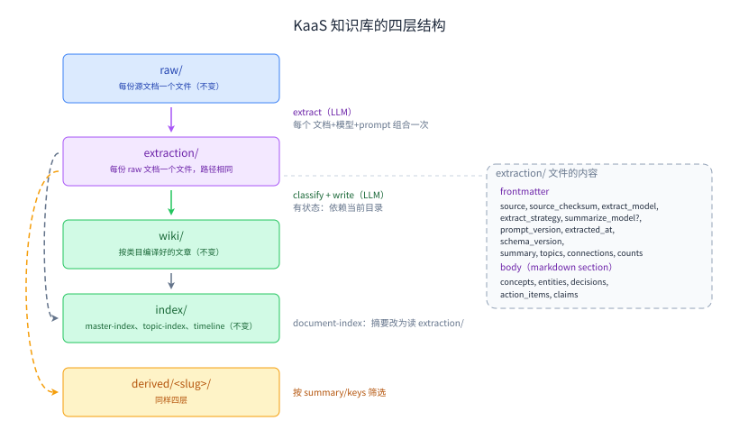

# 把抽取变成一等公民层

> 本文是 [spec.md](spec.md) 的中文翻译副本。**英文版是唯一正本**，两者必须保持同步；
> 出现分歧时以英文版为准。标识符、文件路径、字段名一律保留英文原文。

日期：2026-08-07
Slug：`extraction-layer`
状态：已对齐。O1–O7 在第一轮对齐中定案，S1 与 Q1–Q10 在第二轮定案，理由记录在
[alignment-questions.md](alignment-questions.md)。无未决问题。

## 背景

KaaS 知识库已经有四个阶段，但只有三个在磁盘上有名字。`raw/` 放文档，`wiki/` 放编译好的
文章，`index/` 放导航。第四个阶段——所有下游产物赖以构建的那份逐文档抽取——住在
`.extract-cache/` 里，名字写着「可丢弃」。

它并不可丢弃。写相位从抽取结果组装文章，从不回头读 raw：

```python
# py/src/kb_ai/commands/pipeline/_phase_write.py:53
all_sources = [(ref, ext) for _ch, ref, ext, _action, _det in ops]
combined, merge_refs = _combine_extractions(all_sources)
new_content = merge_into_article(art_path, old_content, combined, ", ".join(merge_refs), ...)
```

文档级的主题筛选也读抽取摘要：`_document_summary`（`py/src/kb_ai/storage/index.py:140`）
先试文档自己的 frontmatter，再试 `store.load_extract_cache(...)["summary"]`，最后退到
正文第一段。

所以抽取既是文章正文和文档筛选的事实来源，又被当作缓存存放。由此产生三项具体代价。

**1. 两条摄入路径对「是否持久化」的做法不一致。** CLI 路径缓存抽取结果
（`commands/compile.py:133` 读，`:146` 写）。Go worker 路径不缓存：`_handle_extract`
（`py/src/kb_ai/server_daemon.py:117`）把抽取结果放在响应里返回、不写任何文件，桥把它
当不透明 blob 传递（`internal/bridge/api.go:42`），worker 直接把它在内存里交给 pipeline
（`internal/worker/worker.go:123`）。因此经 HTTP API 或 Web UI 提交的文档
**根本没有持久化的抽取结果**。提交时什么都不会失败，后果要到很久之后才显现：这类文档会掉进
`_document_summary` 的第一段兜底分支，于是 derive 的文档目录看到的摘要明显劣于
CLI 摄入的文档。derive 的 `copy_documents` 找不到东西可拷（`derive/_layout.py:195`），
派生库的 compile 要重新付一次抽取的钱。重跑 pipeline 也要重新付，而 CLI 不用。
最终筛选质量取决于走了哪条摄入路径。

**2. 文件里没有 provenance，所以过期无法检测。** `extraction_to_dict`
（`core/extract.py:77`）恰好输出八个 payload 字段——`summary`、`concepts`、`entities`、
`decisions`、`action_items`、`claims`、`topics`、`connections`——关于「它们从哪来」
一个字都没有。文件名是源文档的内容校验和，这让**文本**过期不可能发生，但对模型和
prompt 一无所知。换掉抽取模型，或者编辑 `prompts/defaults/extract.md`（可通过
`KAAS_PROMPTS_DIR` 按部署覆盖，`core/extract.py:85`），所有已有条目都会被静默复用。
代码自己已经承认了这一点，在 `derive/_layout.py:168-170`：*「the cache key carries no
model or prompt version, so compiling a derived KB with a different model than the
source reuses the other model's extractions.」*

**3. 读路径在重建本可以直接读到的东西。** 今天要拿到一份文档的摘要，你得读文档、
哈希它的字节、拿哈希去缓存目录里查，还得为查不到准备两层兜底。而且拿到的摘要是为抽取
写的、不是为目录行写的：它的中位长度是 361 字符，而目录的 `SUMMARY_MAX_CHARS = 200`，
所以大部分条目被截断（`storage/index.py:156-157`）。

本 spec 不新增任何流水线阶段。它只给已经存在的第四个阶段一个名字、一个稳定的文件名和
一个头部：



`raw/` 和 `extraction/` 里的文件名完全相同，例如
`window-2026-06__docs__2026-06-01-abf-day-1.md` 在两棵树里都是这个路径。

不在这张图上的东西全部保持原样：`.classify-cache/`（它确实是缓存——键里含目录状态）、
`.compile-state.json`、`.compile.log`、`kaas.json`、`derived/*/manifest.json`。

## 目标

1. 四个有名字的层，各司一职，让读者能指着一个目录说出它装什么、不必读代码：
   `raw/` = 进来了什么，`extraction/` = 我们对每份文档理解到了什么，`wiki/` = 我们组装
   出了什么，`index/` = 怎么找到它。
2. `extraction/` 与 `raw/` 一一对应、相对路径相同，映射关系从文件名就能读出来，
   不需要哈希这一步。
3. 每份抽取文件自带 provenance，让「这份过期了吗、为什么」从未知变成字段比对。
4. 两条摄入路径——CLI `compile` 和经 Go worker 的 HTTP/UI 提交——产出同一个抽取层，
   于是下游质量不再取决于摄入路径。
5. 读路径变短：文档目录从一个能叫出名字的文件里读摘要，不再哈希文档、再拿哈希去缓存里
   查（E1）；derive 拷贝一个能叫出名字的文件，而不是一个得重新算出来的哈希。
6. 编辑一个抽取 prompt 的代价是一趟抽取，不是一次完整重编译。prompt 调优正是这一层
   要服务的工作流，它的价格必须有界且可预测。

## 非目标

- 移除或重构 `index/`。四个索引文件全部保留，`document-index.md` 保持现有格式；
  变的只是它怎么算出来。
- 修改 extract、classify、merge 的 prompt，或文章格式。
- 迁移 `.extract-cache/`（S1）。旧缓存原地废弃、不做转换。没有迁移命令、没有自动迁移、
  没有被祖父条款豁免的 provenance。
- 与本次改动之前产出的知识库保持兼容，两个方向都不保。改动前的派生库在不读抽取结果的
  检查上继续可用（F5），在读抽取结果的检查上不可用（F3）。
- 让一次 compile 仅凭 `extraction/` 就可复现。classify 是刻意有状态的——它的键是
  `checksum-articlesHash-categoriesHash`（`core/classify.py:268`），因为同一份文档在
  周围的 wiki 变化之后本就应该被路由到别处。本 spec 不把这件事抹平。
- 把 derive 从「拷贝文档」改成「引用文档」。那是一项真实的简化，也是一个独立决定：
  今天的拷贝是刻意的（*「Copied, not symlinked, so deleting the source KB cannot
  invalidate the derived one」*，`derive/_layout.py:165-166`），而引用与
  `build_document_catalog` 所面向的跨库、只读源场景冲突。
- 回收孤立的缓存文件，或对 `.classify-cache/` 做任何改动。
- 给写相位配上它自己的 provenance。抽取在这里拿到了 provenance，classify 也早已哈希了
  自己渲染后的 prompt（`core/classify.py:88-100`），但编辑 `merge-rewrite.md` 或
  `merge-diff.md` 仍然什么都不会失效，因为写相位只由 `.compile-state.json` 把关。
  在此明确记为已知缺口，以免被读成疏漏。

## 用户故事 / 场景

**S1——新人读布局。** 有人打开一个知识库目录，不看源码就能叫出每一层的名字。
`extraction/` 挨着 `raw/`、文件名相同；文章正文来自它而不是来自 `raw/` 这件事是看得见
的，不需要推断。

**S2——经 Web UI 摄入的文档，被筛选得和经 CLI 摄入的一样好。** 运维把一份会议记录粘进
UI，然后派生一个主题库。这份文档按它的抽取摘要被评判，与 CLI 编译的文档完全一致，
因为 worker 路径现在会把它已经付过钱的抽取结果持久化下来。

**S3——抽取 prompt 变了。** 维护者编辑 `prompts/defaults/extract.md`。下一次 compile
报告所有抽取结果现已过期、重新抽取它们，然后就停在这里——wiki 不会被重写，报告会说明
它现在落后了多少。用 `--extract-only`，维护者可以先重抽、在编辑器里读新文件，
再决定要不要为写相位付钱。

**S4——检查并修补一份糟糕的抽取。** 某篇文章读起来不对。维护者打开它所源自文档的抽取
文件，看到产生这篇文章的 summary 和 decisions 列表，可以修正或删掉这一个文件来强制
重抽——不需要去猜一个以校验和命名的缓存条目。

## 验收标准

### A. 布局与命名

- A1. 抽取结果放在 `<kb>/extraction/`，一个普通（非点开头）目录。
- A2. 对于位于 `raw/<rel>` 的 raw 文档，其抽取结果位于 `extraction/<rel>`——相对路径
  完全镜像，包括中间目录和 `.md` 扩展名。`raw/` 是用 `rglob("*.md")` 扫的
  （`storage/store.py:114`），所以嵌套路径是可能的、必须能往返。不做任何后缀算术——
  正是后缀算术让 `eba18d0` 修掉的那个双后缀 bug 成为可能。
- A3. `extraction/` 下的 `.md` 不与任何东西冲突：现有的每一处 markdown 扫描都以
  `wiki/` 为根（`storage/index.py:255`、`core/people.py:165`、
  `pipeline/_entry.py:118`、`internal/api/derive.go:259`、`internal/api/wiki.go:237`）
  或以 `raw/` 为根（`storage/store.py:114`）。没有任何代码遍历知识库根目录，
  本 spec 也不新增这种代码。
- A4. 路径→路径的映射是 `KBStore` 里的一个函数，所有读者和写者都用它；
  没有调用方自己拼路径。
- A5. `extraction/` 遵守与 `raw/` 相同的扫描规则：跳过点文件，`_skipped/` 段之下的
  任何东西都不读不写（`storage/store.py:107-122`）。
- A6. 任一时刻每份 raw 文档恰好对应一个抽取文件。重新抽取是原地覆盖，
  不会积累出第二个文件。

### B. 文件内容与 provenance

- B1. 抽取文件是带 YAML frontmatter 的 markdown。frontmatter 携带 provenance——
  `source`（`raw/<rel>` 路径）、`source_checksum`（与 `_compute_checksum` 产出相同的
  16 位十六进制前缀）、`extract_model`、`extract_strategy`、`summarize_model`
  （仅 summarize 路径，见 B15）、`prompt_version`、`extracted_at`、`schema_version`
  ——外加三个足够扁平、适合放在这里的 payload 字段：
  `summary`、`topics`、`connections`。
- B2. body 以 markdown section 承载五个对象列表型 payload 字段，顺序固定为：
  `concepts`、`entities`、`decisions`、`action_items`、`claims`。每个 section 的内容
  就是该字段列表的 `yaml.safe_dump`，于是每个条目的每个字段都是显式标注值，
  绝不靠排版暗示。section 顺序是写死的、不由 dict 迭代顺序决定，因为它是 C2
  字节一致性的一部分。

  ```markdown
  ---
  source: raw/window-2026-06__meetings__2026-06-04-video-meetingcc.md
  source_checksum: 0123456789abcdef
  extract_model: claude-sonnet-4-6
  extract_strategy: chunked
  prompt_version: a1b2c3d4e5f6
  extracted_at: '2026-08-07T11:22:33+00:00'
  schema_version: 1
  summary: ...
  topics: [...]
  connections: [...]
  counts:
    action_items: 2
    claims: 5
    ...
  ---

  ## Claims

  - claim: ...
    surprising: false
  ```

- B3. section 的标题是字段名的纯函数——`action_items` →
  `.replace("_", " ").title()` → `Action Items`，反向为
  `.lower().replace(" ", "_")`。五个字段名全是小写加下划线，所以往返精确，
  没有映射表需要维持同步。
- B3a. 标题**只在第 0 列**才算标题——`line.startswith("## ")`，绝不是
  `line.strip().startswith("## ")`。这是承重的，不是风格问题。`safe_dump` 把含换行的
  字符串渲染成**多行**单引号标量，它的续行是真实的物理行、缩进至少两个空格：

  ```
  - claim: '决议如下

      ## Entities

      后半段'
  ```

  实测：用 `strip()` 扫描时，这个文件会多出一个幻影 `entities` section，而 `claims`
  section 变成未闭合的引号标量，`safe_load` 抛 `ScannerError`。接着 B9 把这份抽取判为
  不存在，于是这份文档每次 compile 都被重抽、却永远编不出文章——正是 C10 要消灭的那个
  永久重抽状态。PyYAML 在 block sequence 里的续行必然带缩进，所以第 0 列判定对同一份
  fixture 精确往返。O1 里「32,319 个字符串值中 0 个内嵌换行」的实测说明这在今天的产出里
  罕见，它没有说下一次 prompt 改动不会产生它。
- B4. frontmatter 另外携带 `counts`，即每个 section 的条目数。section 计数与 `counts`
  不符的解析结果是损坏文件（B9），不是空文件。配合 B3，`counts` 校验成为一次 dict
  直接比对。它也是消除 markdown 那个失败模式的关键：没有它，一个拼错的 `## Claims`
  标题会静默产出零条 claims、一篇更单薄的文章，而任何地方都不会报错。
- B5. frontmatter 和每一个 body section 都用
  `yaml.safe_dump(..., allow_unicode=True, default_flow_style=False, width=10**6)`
  写出，与 `core/people.py:117` 一致。`allow_unicode` 让 CJK 不被转义——body 才是
  CJK 密集值所在的地方，比如一个 concept 的 `definition`——而 width 上界防止 PyYAML
  折叠长值，那种折叠会静默损坏内容。因此标量**内部**的引号与转义都是 PyYAML 的责任、
  不是手写的：这正是 H2 里 `"`、`: `、`no` 和 CJK 那几个 fixture 能天然通过的原因。

  `safe_dump` 不免费提供的是「一个值一行」。值里的换行会让它变成多行引号标量，
  而它的续行会与本格式赖以工作的两个面向行的分隔符打起来：`## ` 标题（B3a）和
  frontmatter 的 `---`（B6）。两者都被显式关掉，而不是假设它不会发生。
- B6. 读取复用现成的 `split_frontmatter`（`py/src/kb_ai/_frontmatter.py`），
  不新增第二个分割器。它的 docstring 记录了 commit `eba18d0` 修掉的
  `content.split("---", 2)` bug，而那个 bug 正是新写一个分割器会重新引入的风险。
- B6a. `split_frontmatter` 判定结束分隔符改用 `line.rstrip() == "---"`，
  而不是今天的 `line.strip() == "---"`（`_frontmatter.py:25`）。用 `strip()` 时，
  一个 `summary` 里含有恰好是 `---` 的一行，会被 dump 成续行 `  ---`，strip 之后与
  分隔符相同，于是 frontmatter 在标量中间被截断；实测 `safe_load` 随即抛
  `ScannerError`，截断点之后的每个键全部丢失。`rstrip()` 仍然容忍真分隔符后的尾随
  空白——那是 `strip()` 唯一买到的东西——同时拒绝带缩进的分隔符，而带缩进的分隔符
  从来不是合法分隔符。这是对共享代码的改动，且是刻意的：同样的潜在截断对今天的
  wiki 文章读者和 raw 文档读者都成立，而 B6 要求这一层依赖那个分割器。
  它需要现有 `_frontmatter` 测试全绿，外加一个新用例。

  在 B5、B6 与 B6a 之下，O1 接受为代价的那对序列化器/解析器缩减为
  「第 0 列定位标题」加 `safe_load`。
- B7. 因为筛选需要的一切都在 frontmatter 里，做目录或主题筛选的读者只解析
  frontmatter，从不解析 body。
- B8. 写入是原子的——临时文件加 `os.replace`，与 `save_compile_state`
  （`storage/store.py:301`）和 `write_manifest`（`derive/_layout.py:203`）一致——
  所以写到一半崩溃不会留下头部与 payload 不一致的文件。
- B9. 缺失、无法解析或计数不符的抽取文件一律视为「不存在」，绝不视为「空但有效」，
  并且要报出原因。它绝不能静默产出一篇没有内容的文章。
- B10. 当 `source_checksum`、`extract_model`、`extract_strategy`、`prompt_version`
  中任何一个与当前源文档和配置不符时，抽取结果即为**过期**；当记录的
  `extract_strategy` 是 `summarize` 时，`summarize_model` 也参与比对。过期判定是字段的
  直接比对，没有特殊值、没有豁免：不调 LLM、不走网络、没有 `unknown` 这一档。
  参与比对的字段集就是「记录的那个策略实际用到的字段」——`chunked` 四个、
  `summarize` 五个——所以 `summarize_model` 的变化不会因为一个从未参与的模型
  把 chunked 抽取判为过期。
- B11. `prompt_version` 是对抽取阶段 prompt 集合**当前渲染结果**的 12 位十六进制
  哈希，与某一次运行实际用了哪些 prompt 无关。哈希输入为：`extract`、
  `merge-summaries`、`summarize` 三者加载到的内容，加上 `extract-types` 的五个渲染
  变体——对 `TYPE_SPLIT_GROUPS_K2` 和 `TYPE_SPLIT_GROUPS_K3` 自身枚举出的每个
  `(k, group)` 调用 `_render_type_split_prompt`，因此没有任何镜像。名字与内容之间用
  NUL 分隔符加长度前缀框定，使得尾部换行不可能与下一个名字混淆。

  ```python
  EXTRACT_STAGE_PROMPTS = ("extract", "extract-types", "merge-summaries", "summarize")
  ```

  哈希**渲染结果**而不是 `extract-types.md` 原文，是为了让
  `TYPE_SPLIT_GROUPS_K2/K3` 和 `_FIELD_JSON_SCHEMAS`（`core/extract.py:95-115`）
  的改动可见。它们是代码常量，但会改变实际发给模型的文本；而渲染函数和两张表都已存在，
  所以补上这个盲区不花任何成本。

  这也是 `classify_inputs_hash` 早已建立的约定（`core/classify.py:88-100`），
  它的 docstring 记录了此前只按 categories 哈希的做法恰好有本字段要防的那个静默复用
  bug：*「a prompt-only edit silently kept serving classifications produced by the
  previous prompt.」*
- B12. `prompt_version` 每进程只算一次、做 memo，且在第一次抽取之前算。registry 按名字
  懒缓存（`prompts/__init__.py:23`、`registry.py:48-53`），所以一个长跑的 daemon 可能
  持有编辑前的 `extract` 和编辑后的 `summarize`。没有 B12，这个值就会依赖加载顺序而
  不只依赖时间——同一个 daemon 里相隔几分钟抽取的两份文档可能在代码毫无变化的情况下
  记录不同的哈希，而 H3 的字节一致断言会在这个窗口里假失败。只算一次会把四个名字同时
  钉进缓存，让 `prompt_version` 成为进程级常量，也让「改完 prompt 重启 daemon」
  成为一条精确规则而非模糊说法。
- B13. 计算 `prompt_version` 绝不能倒向「fresh」。prompt 文件缺失或无效会让
  `load_prompt` 抛 `NoActivePromptError`（`registry.py:88`）；读路径必须捕获它、
  按 B9 的方式报出原因，而不是崩掉或假定新鲜。
- B14. `load_prompt` 断言其参数属于 `EXTRACT_STAGE_PROMPTS`，于是给抽取新增第五个
  prompt 而忘了登记时会在第一次使用就失败，而不是静默收窄哈希范围。
- B15. `extract_strategy` 记录实际运行的策略，不是请求的策略。`_handle_extract` 接受
  `chunked`、`summarize` 和 `auto`，而 `auto` 按 chunk 数路由——`len(chunks) >= 3`
  走 summarize（`server_daemon.py:152-160`）。记 `auto` 会让这个字段失去意义，
  所以记解析后的值。chunk 大小和 type-split 的 K 刻意不进 frontmatter：
  这些字段的存在意义是被人读到并据此行动，而一个不透明的配置哈希两头都不满足。

  summarize 路径是由**两个**模型驱动的，所以单靠一个 `extract_model` 字段描述不了它：
  `extract_knowledge_summarized(chunks, meta, summarize_model, model)`
  （`server_daemon.py:151`）用 `summarize_model` 跑逐 chunk 的那一趟和
  `merge_summaries_l2`，`model` 只用于 phase 2 的抽取。前一个模型由
  `LLM_SUMMARIZE_MODEL` 或 `LLM_MODEL` 解析（`server_daemon.py:134`），与后一个无关。
  不记录它，两份抽取就可能在 `extract_model`、`extract_strategy` 和 `prompt_version`
  上完全一致，却是不同模型的产物——与 O3a 为策略本身抓到的是同一类缺陷。
  因此 `summarize_model` 只在 summarize 路径记录，chunked 路径不记，因为那里没有这次调用。
- B16. `extracted_at` 是带偏移的 UTC，`timespec="seconds"`，来自唯一的 `_now_iso()`
  helper。这两半都不是从现有调用点整套继承来的：`core/classify.py:71` 带 UTC
  但没有 `timespec`，`derive/__init__.py:230` 有 `timespec="seconds"` 但是 naive 本地。
  被拒绝的是 `commands/compile.py:269` 和 `derive/__init__.py:230` 用的 naive 本地
  `datetime.now().isoformat()`。
  派生库会被交到别的机器上（F4），而 `derive/_layout.py` 用 `shutil.copyfile`
  拷贝，它不像 `copy2` 那样保留 mtime。文件里的这个字段是「什么时候抽的」在跨机器之后
  唯一还站得住的答案，而 naive 本地时间一旦搬走就是误导。`extracted_at` 不是函数参数；
  H3 monkeypatch `_now_iso`，因为一个唯一真实调用方是测试的生产参数，
  就是测试基建漏进了 API。
- B17. `topics` 和 `connections` 在序列化时排序。两者都是 `list(set(...))` 构造的——
  多 chunk 文档走 `core/extract.py:727-728`，merge 走 `_combine_extractions`
  （`:748-749`）——而 Python 的字符串哈希按进程随机化，所以同样内容的
  `ExtractionResult` 每次运行都会给出不同的元素顺序。实测：三个子进程对同样五个 tag
  给出三种顺序。C2 不受影响，它限定在同一个 `ExtractionResult` 上，H3 也在同一进程内跑。
  排序买到的是：重抽一份没变过的文档会产出与之前相同的这两行，于是两份抽取文件之间的
  diff 只显示真正变了的东西——这既是 S4「打开文件看它产出了什么」得以成立的前提，
  也让「未决问题」里那个「知识库进 git」的情形不至于变成噪声。

### C. 写路径一致性与失败语义

- C1. 抽取模块里有一个 `persist()` 函数负责序列化并写出抽取文件。CLI compile 路径在
  今天写 `.extract-cache/` 的位置调用它（`commands/compile.py:146`）；daemon 调用同一个
  函数。任何地方都没有第二个序列化器。
- C2. 同一份文档经任一路径摄入，在模型和 prompt 版本相同时产出**字节一致**的抽取文件。
  抽取 payload 是 LLM 输出，两次真实运行本来就不可能字节一致。C2 是
  **序列化器**的性质、不是抽取的性质，它的测试必然是 stub 掉 LLM 的。它证明的是
  「只有一个序列化器、只有一条代码路径」。`extracted_at` 是唯一非确定的字段（B16）；
  给定同一个 `ExtractionResult`，文件里其余一切都是确定的。
- C3. **由 Python daemon 持久化**，在 extract 那一跳、pipeline 阶段运行之前完成。
  在 Go 侧写盘意味着 Go 里要有第二个 markdown 序列化器，那会把 C2 从结构性质降格为
  两个实现之间的巧合——而且 B5 把 body 也交给了 `safe_dump`，那个实现就不止要复刻
  排版，还要复刻 PyYAML 的转义决策。
- C4. `bridge.ExtractRequest` 增加 `kb_dir`、`source` 和 `model`。前两个本来就在
  worker 手上——`PipelineRequest.KBDir`（`internal/bridge/api.go:57`）和
  `PipelineItem.SourceRef`（`:52`）——只是没有传到 extract 这一跳。两处的 `kb_dir`
  必须是同一个值——今天它们都来自 `w.cfg.KBDir`，带两份会招来日后有人只改一处。

  加 `model` 是因为没有它，两条路径记录的 `extract_model` 就会在结构上不同，
  而不是配错才不同。`ExtractRequest` 只有 `Content`、`Model`、`Strategy` 和
  `SummarizeModel`（`:33-36`），而 worker 只填其中两个——`Content` 和 `SummarizeModel`
  （`internal/worker/worker.go:94-97`）——于是 `_handle_extract` 退回它自己写死的默认值
  `claude-sonnet-4-6`（`server_daemon.py:132`），永远看不到部署配置的
  `LLM.Config.Model`（其默认值是 `gpt-4o-mini`，`internal/config/config.go:106`）。
  model 参数一旦到达 API 就是权威的（`llm/_completion.py:65` 原样传下去），
  所以两种情况下记录的值都是诚实的，只是与 CLI 记下的不是同一个值。
  在任何设置了非默认抽取模型的部署上，每一份经 UI 摄入的抽取都会在下一次 CLI compile
  被 B10 判过期、重抽一次，逐文档、永远如此。C4 本来就要改这个 struct，多加一个字段
  是同一处改动。
- C5. worker 发送的 `source` 是相对知识库根的路径，用
  `filepath.Rel(cfg.KBDir, task.RawPath)` 算一次，同时喂给 `ExtractRequest.Source`
  和 `PipelineItem.SourceRef`。这顺带修掉一个既有 bug：`internal/api/submit.go:60`
  用已经绝对化的 `KBDir` 造出绝对的 `rawPath`，而 `internal/worker/worker.go:125`
  原样把它当 `SourceRef` 转发，于是经 HTTP API 或 Web UI 摄入的文档产出的文章，
  其 `sources:` 条目是绝对文件系统路径，而 CLI 编译的文章带的是 `raw/<rel>`。
  实测方式是用 `split_frontmatter` 解析每篇文章的 frontmatter 并统计 `sources` 条目：
  参考库 78 篇文章共 153 条，七个派生库另有 314 条，任何地方都是 0 条绝对路径。
  所以没有任何既有产物需要读侧同时容忍两种形式。
- C6. daemon 在调用模型之前先读 `extraction/<rel>`，若文件存在且 B10 的字段全部匹配
  就原样返回它。这是让重试免费的关键。重试是真实存在的——`MaxAttempts` 加 `Nack`
  会把任务退回 pending（`internal/queue/queue_test.go:79-92`、
  `internal/worker/worker_test.go:172,186-189`），而 `w.fail` 就是一个 `Nack`
  （`internal/worker/worker.go:147-154`）——所以今天 pipeline 失败且还有 attempt 时，
  整个任务重跑、抽取的钱付第二遍。这不违反 O4：它不是在抽取。
- C7. 写失败即任务失败。daemon 返回错误，worker 带着原因调 `w.fail`，
  不存在「抽取了但没持久化」这个状态。另一种做法需要给 `ExtractResponse` 加一个标记
  ——它今天只有 `Extraction` 和 `Cost`（`internal/bridge/api.go:40-43`）——
  再加一条把 warning 带到任务记录上的通路，而 `Warnings []string` 在仓库里只存在于
  **derive** 的响应上（`:168`）。一条代码路径 vs 一条新的半成功协议。
  接受的代价：磁盘错误后重试要真金白银，而 C6 救不了它，因为写失败意味着盘上没有
  东西可复用。
- C8. 写入不重试。B8 的原子「临时文件加 `os.replace`」已经覆盖了写一半的情况；
  真正会失败的是 ENOSPC、EACCES 或 EROFS，它们都不会在几毫秒内自愈。报出原因，
  让运维去修盘。
- C9. daemon 对收到的内容做一次 `\r\n` 与孤立 `\r` → `\n` 的归一，在
  `_handle_extract` 收到时完成——在哈希之前、分块之前、抽取之前。没有这一步，
  两条路径会在两个地方分叉。`_compute_checksum`（`storage/store.py:53`）吃文本，
  它的五个调用方全部喂进 `read_text()` 的结果（`:127`、`storage/index.py:164`、
  `derive/_sources.py:95,179`），也就是已经过 universal-newline 归一的文本；
  `iter_raw_file_meta` 刻意用 `newline=None` 打开文件以维持字节等价，并把这个契约写进了
  docstring（`store.py:132-149`）。而 Go worker 直接把文件字节作
  `Content: string(content)` 发出（`internal/worker/worker.go:95`），CRLF 原样保留。
  于是对任何 CRLF 文档，daemon 算出的 `source_checksum` 与 CLI 的不同，于是 B10 报它
  永久过期、F3 永久跳过它的拷贝，两者都无声。daemon 喂给模型的字节也与 CLI 会喂的
  不同。收到时归一同时解决这两件事；放进 `_compute_checksum` 只解决第一件。
  `_compute_checksum` 保持不动，因为它现有的调用方本来就传归一过的文本。
- C10. 当每一个 chunk 的摘要都失败时，抽取抛异常而不是返回空结果。今天两条抽取路径的
  做法不一致：分块路径 `all_results[idx] = future.result()` 没有 `except`
  （`core/extract.py:711`），失败直接向上传播；而 summarize 路径把失败吞成一句 warning
  （`:608-613`）并返回一个裸的 `ExtractionResult()`（`:617-618`）——与「模型读了内容
  但没什么可说」完全无法区分。改为抛异常之后，空抽取只可能是那个合法情形，
  它会被正确持久化；写路径不需要任何空值检查，也不会有某个文件每次 compile 都被重抽、
  永远重抽。部分 chunk 失败保持今天的降级行为，`if not chunks:`（`:585-586`）
  也继续返回空结果，因为空文档抽出空结果是诚实的。
- C11. compile 区分「首次抽取」与「覆盖了已有文件的抽取」，并把后者单独报告。
  这些文档被修订过，所以从它们 merge 出的文章是把新内容叠在上一版已经贡献的内容之上，
  而两条 merge 路径都只能追加：`merge-diff.md` 只提供 `append_to_section` 和
  `new_section`，没有删除或替换原语，`merge-rewrite.md` 对更正和取代只字未提。
  达到或超过 `_LARGE_ARTICLE_THRESHOLD = 30_000` 字节的文章（`core/merge.py:197`）
  一律走只追加路径——参考库 78 篇文章里已有 4 篇符合，而文章只会随着被 merge 越长越大。
  本条不引入 prompt 改动、不引入新的 LLM 调用；它只是点名哪些文章在源文档被修订后
  需要人再读一遍。本条仅限 CLI：修订文档报告复用写相位在 `commands/compile.py` 里
  已经建好的 `_file_done_articles` map，而 Go worker 路径走的是
  `commands/pipeline/_phase_write.py`，那里没有对应物。

### D. 组装契约

- D1. classify 和 write 在两条路径上都只从 `extraction/` 读。在 CLI 路径上这意味着
  写相位从盘上读 `extraction/<rel>`，而不是接收一个穿过 `article_ops` 传下来的内存态
  `ExtractionResult`（`commands/compile.py:252,263`）。在 worker 路径上同样如此，
  而且它**并非**已经成立：今天两个相位都不读 `raw/`（`_phase_write.py:53`），
  但也都不读 `extraction/`——抽取结果作为不透明 blob 装在 `PipelineItem.Extraction` 里
  （`internal/bridge/api.go:50`）送来，在 `_phase_classify.py:126,132` 于内存中解析。
  所以 `PipelineItem.Extraction` 被删掉，pipeline 改为按 `source_ref` 去读
  `extraction/<rel>`。值得为此改 Go 而不是留着 blob，有两个理由。它让 D1 成为真正的
  不变量，而不是「一条路径的描述加另一条路径的内存等价物」。而且它把解析器放进两条路径的
  生产链路，于是序列化器/解析器的不对称不可能在 C3 存在意义所指的那条路径上悄悄发布——
  留着 blob 的话，解析器只会被 CLI 和 H2 走到。
- D2. 由于 D1，本 spec 把此前隐含的事情说明白：抽取质量是文章质量的上界，
  而对 extract 的 prompt 改动会让它下游的一切失效。
- D3. 文章 `sources:` frontmatter 记的是 `raw/<rel>` 路径，不是抽取路径。
  derive 的文档解析（`derive/_sources.py`）契约不变。C5 是让这一点在 worker 路径上
  也成立的那处改动。

### E. 目录与索引

- E1. `build_document_catalog` 继续用 `store._iter_raw_paths()` 遍历 `raw/`
  （`storage/index.py:200`），并按每份文档去读 `extraction/<rel>`——这是**以 raw 路径
  为键的查表**，不是对 `extraction/` 的遍历。有两件事逼出这个做法。目录行的 `title`
  和它的 `date`/`source` 前缀来自 raw 文档自己的 frontmatter
  （`_DOC_CONTEXT_KEYS`，`storage/index.py:22`），而抽取文件不带这些。
  另外孤立抽取是真实存在的——回收它们是明写的非目标，所以一份被删掉或改名的文档会留下
  `extraction/<旧 rel>`，而遍历目录会把它当成一份仍然存在的文档写进 `document-index.md`。

  E1 去掉的是校验和计算和缓存查表（`storage/index.py:164`），不是那次读盘：
  每份文档省下一次 `sha256` 和一次 `stat`。值得说清楚，因为布局图里
  「对 `extraction/` 的直接归并」把它说大了。
- E2. `_document_summary` 的三层兜底收缩为：文档自己声明的 frontmatter `summary`
  若存在则用它，否则用抽取结果 frontmatter 里的 `summary`（B7——为此绝不解析 body）。
  第一段分支只为「尚无抽取结果」的文档（已抓取但从未编译）保留，而且这种情况要被报告、
  不能无声。
- E3. `index/document-index.md` 保持现有名字、位置和行格式
  （`storage/index.py:230-231`）。`master-index.md`、`topic-index.md`、
  `topic-index-longtail.md` 和 `timeline.md` 不受影响。
- E4. 有文档但没有抽取结果的知识库仍然能产出目录——「从未编译过」这个情形必须继续可用。

### F. Derive

- F1. `copy_documents` 在拷每份 `raw/<rel>` 的同时拷 `extraction/<rel>`，
  在两棵树里镜像同一个相对路径，取代按校验和寻址的
  `.extract-cache/<checksum>.json` 拷贝（`derive/_layout.py:195-199`）。
  校验和查表消失，两次拷贝合成一个循环。
- F2. 抽取结果缺失仍然不是错误：派生库的 compile 会抽取并付一次钱，与今天相同。
  每一个**现有**派生库都正处于这个状态：`data/kb-2026-06/derived/` 下的七个都只有
  `.extract-cache/`、没有 `extraction/`，而 S1 不做转换，所以它们中任何一个下一次
  compile 都要对自己的文档跑一趟真实抽取。实测文档数：53、30、25、24、24、23、20，
  合计 199 份，按 G3 实测的每份 0.162 USD 算，最大的那个约 8.6 USD，
  七个全部重编约 32 USD。H8 一分钱都不会花，它只读 `manifest.json`（F7）；
  在这里标价是为了不让人误触。
- F3. 拷过去的抽取结果的 `source_checksum` 必须与拷过去的文档字节相符，
  否则跳过这次拷贝并报告。这项检查是路径寻址得以安全的前提，
  它替代了内容寻址文件名此前提供的那个隐含保证。
- F4. 派生库与其父库有相同的四层，包括 `extraction/`。在 KaaS 版本固定的前提下，
  一个派生库自身自洽、可独立使用：拷过去的抽取结果对拷过去的文档满足 B10，
  所以派生库的 compile 在抽取上一分钱不花。接受的后果：
  设置了 `KAAS_PROMPTS_DIR` 的人打开一个派生库，其中每一份拷来的抽取结果都会被判过期，
  他们的第一次 compile 会全量重抽。这是 O3 的本意——能看见部署本地的覆盖正是它选择
  内容哈希的理由之一——但它现在带上了账单。
- F5. 派生库能报告自己是否已落后于父库。写侧已经存在、无需改动：`manifest.json` 带一个
  顶层 `documents` 数组，每份拷贝的文档一条 `{rel_path, checksum, size_bytes}`
  （`derive/__init__.py:98-99`）。新增的是读侧——一个纯函数，重新哈希父库的 `raw/`
  并把每条归类为「同步」、「父库已改」或「父库已删」。不调 LLM、不走网络、不升 schema。
- F6. 父库不可达时 F5 降级而不失败。`source_kb` 存的是绝对路径
  （`derive/__init__.py:79`），而 derive 本就是为可能只读、可能属于别人的父库设计的，
  所以无法解析的父库产出 `unknown` 而不是错误。
- F7. F5 与 F3 回答的是不同问题，两者都需要。F3 问的是「这个派生库拷来的抽取结果
  与它自己拷来的文档相符吗」——内部一致性。F5 问的是「自我被派生以来，
  父库那份文档动过吗」——与源的偏离。一个派生库可以通过 F3 而仍然落后好几个月。
  这个划分也决定了改动前的派生库还能做什么：F5 只读 `manifest.json` 和父库的 `raw/`，
  所以对它们照样可用；而 F3 会把每份文档都报成缺失，因为它们只有 `.extract-cache/`
  没有 `extraction/`。
- F8. F5 只报告，绝不重新派生。源变化时刷新派生库仍然是 derive 这个 feature 的非目标，
  而在读路径上花钱被 O4 排除。

### G. 门控、花费与首次运行

- G1. 抽取与组装**各自独立**门控。当一份文档的抽取结果缺失、或按 B10 判为过期时，
  抽取为它运行。当 `.compile-state.json` 说某份文档落后时（`commands/compile.py:99-104`，
  含 `completed_ops` 续跑分支），写相位为它运行。两个遍历 `raw/` 的循环、两道门控、
  中间靠一个盘上产物交接。
- G2. G1 是 D1 已经隐含的形状，所以它不带来额外结构。今天三个相位遍历同一个选中集——
  抽取在 `commands/compile.py:132`、classify 在 `:179`（经 `items_to_classify`）、
  write 在 `:235`——而抽取缓存是那个选中集**内部**的第二层缓存，不是它的门控。
  在 G1 之下，「选中集 + 内层缓存」这一对变成两道普通门控，概念更少；
  并且写相位不再需要 raw 内容，这解开了 `commands/compile.py:91-95` 那个内存 TODO。
- G3. 因此编辑一个抽取 prompt 的代价是对整库跑一趟抽取，仅此而已：参考库 108 份文档
  **约 17.5 USD**；相对地，把抽取过期折进单一选中集会触发一次完整重编译，30.2 USD。
  这是实测、不是外推——参考库自己那次从零编译的日志就在盘上，
  `data/kb-2026-06/.compile.log`：

  ```
  Phase 1 done: 108 extracted (0 cached), 0 errors, $17.4541, 720.5s
  Phase 2a done: 108 classified (0 cached), 0 errors, $2.0499, 599.2s
  Phase 2b done: $10.7246, 1131.1s
  Compile done: 108 compiled, 0 errors, $30.2286 total
  ```

  口径与注意事项。那次运行就是今天这个库的来源：它的 108 条 `.compile-state.json`
  校验和与 108 个 `.extract-cache/` 文件名一一对应，`compiled_at` 是
  `2026-08-06T16:01:38`，正是日志自己的时间戳。折算成每份文档，抽取 0.162 USD、
  classify 0.019 USD。日志和 `kaas.json` 都没有记录那次运行用的模型，
  所以这个数字的口径是「2026-08-06 当时生效的抽取模型」，即默认的 `claude-sonnet-4-6`，
  它会随模型变化。

  本条早先的草稿把这个数字写成 1.4 USD，做法是把一次**派生库** compile 的残差
  ——53 份文档、5.0644 USD 总计、其中写相位 4.3763 USD——当成「extract 加 classify」。
  那个残差只是 classify。derive 会把父库的缓存条目连同文档一起拷过去
  （`derive/_layout.py:195-199`），所以那次运行的日志是
  `Phase 1 done: 53 extracted (53 cached), 0 errors, $0.0000`，抽取一分钱没花。
  逐文档看，extract 是 classify 的约 8.5 倍，这就是那次误差的全部来源。

  更正之后仍然成立的：双门控拆分在成本上依然更优，17.5 对 30.2 USD。不再成立的：
  它优的倍数是 1.7×、不是 7×，所以成本已经不再是支持它的主要论证。G4 才是。
- G4. 不重写 wiki 本身就是正确行为，与它省下多少钱无关。O4a 记录了 merge 只能追加，
  所以在 prompt 变更后重跑写相位并不会产出「用新抽取重写的文章」——
  它会把新抽取的内容 merge 进仍然带着旧抽取内容的文章，累积重复与自相矛盾。
- G5. G1 的代价是 wiki 可能落后于 `extraction/`，而这个落后要被报告、不能无声。
  compile state 记录文章是从哪个 `prompt_version` 写出来的，compile 报告有多少篇文章
  是用更旧的抽取写的。不调 LLM、不走网络。这与 C11 和 F5 是同一个
  「检测并报告、绝不自动花钱」的形状。

  `.compile-state.json` 里的单文件条目今天是 `{"checksum", "compiled_at"}` 或
  `{"checksum", "completed_ops"}`（对参考库全部 108 条已核实），所以没有任何现有条目带
  `prompt_version`。叠上 G8 的全量重抽，改动后第一次 compile 会把**每一篇**文章都报成
  「用更旧的抽取写的」。这确实是事实，它们本来就是；但它读起来像故障，所以第一次运行时报告要说明原因，
  而不是只打一个数字。H7 的记录里把它记为预期行为。
- G6. compile 可以只跑抽取相位然后停止。这服务于 O1 选择 markdown 的那个工作流：
  改完 prompt 重抽、在编辑器里读新文件，再决定要不要为写相位付钱。

  这个开关放在哪里必须点明，因为 `compile` 没有可以挂 `--extract-only` 的 flag 面：
  它是一个从 stdin 读 JSON 的桥命令（`__main__.py:54` → `run_compile` →
  `read_input()`），不接受 argv，而且没有任何 Go 代码调用它——`internal/bridge` 里
  压根没有 `Compile` 方法。真正的两个入口是 `distill` 与 `derive` 在进程内调用的
  `compile_kb()`，以及 `python -m kb_ai compile` 加 stdin 上的 JSON。所以：
  `compile_kb()` 增加一个 `extract_only: bool = False` 参数，`run_compile` 从 payload
  里读 `extract_only`，`distill` 的 argparse 增加 `--extract-only` 转发它。
  这就是全部面，不需要改 Go——这也是 G6 留在阶段 1 的原因。
- G7. 只有 compile 可以抽取（O4）。所有读路径——目录构建、`derive` 筛选、HTTP 读、
  MCP `ask`、Web UI——都使用盘上现有的东西，并在不调 LLM 的前提下报告过期。
  C6 在 worker 路径上的「先读再抽」不是例外：那是 daemon 在拒绝抽取。
- G8. 参考库的 `extraction/` 由「把 108 份文档从零抽一遍」填充，
  因为 `.extract-cache/` 不做迁移（S1）。这就是改动后的第一次 compile，
  它用对同一份工作的第二次测量来确认 G3 的 17.5 USD。这是一笔真金白银，需要在运行之前批准。

### H. 验证

- H1. 上述每一条标准都有一个不调用真实 LLM 的测试覆盖。
- H2. 一个严格的往返测试，它是承重的，因为 markdown body 会被解析回写相位消费的那些
  对象：extract → 写文件 → 读文件 → 组装，断言解析出的 `ExtractionResult` 与原始对象
  逐字段相等。fixture 必须覆盖：全程 CJK；含 ASCII `:` 加空格的值；含 `"` 的值
  （实测参考库 32,319 个字符串值里只出现 1 次，否则这条路径永远不会被走到）；
  值恰好为 `"no"` 的字符串字段（YAML 1.1 把 `no/yes/on/off` 当布尔，
  所以 `safe_dump` 必须给它加引号来保住类型）；每个字段的空列表；
  一个为空的 `decisions[].who`；长到会触发 YAML 折行的 summary；
  以及一个被刻意破坏的 body section，用来断言 `counts` 检查（B4）会触发。

  另有两个 fixture 覆盖 B3a 和 B6a 存在的那两个内嵌换行情形，且都断言精确往返、
  不只是「不崩」：一个 body 值里含 `\n## Entities\n`，一个 frontmatter 的 `summary`
  里含恰好是 `---` 的一行。两者都实测在 B3a 和 B6a 所替换的 `strip()` 读法下抛
  `ScannerError`，所以每个 fixture 对着「想当然的实现」会失败、对着规定的实现才通过。
  O1 里「0 个内嵌换行」的实测正是它们必须手写的原因：参考库里没有任何文档能产出这两种形状。

  `ExtractionResult` 在 `extraction_to_dict` 的八个字段之外还有第九个字段——
  `source_path`（`core/extract.py:61`）——CLI 在抽取之后赋值
  （`commands/compile.py:183`），worker 路径从 `source_ref` 赋值
  （`_phase_classify.py:133`）。解析器从文件的 `source` frontmatter 填它，
  所以「逐字段相等」比的是一个 `source_path` 也按同样方式设过的原始对象，
  而不是那个 `source_path` 仍为 `""` 的、刚抽完的裸对象。
- H3. C2 的一致性测试：同一份 fixture 文档分别走 CLI 路径和 daemon/worker 路径，
  产出相同的抽取文件。它在**同一个进程内**跑两条路径——否则 B12 的进程级 prompt 缓存
  会让这个测试测的是缓存时序而不是序列化器——并且 monkeypatch `_now_iso`
  而不是传时间戳参数（B16）。
- H4. B10 的过期矩阵测试：每个 provenance 字段各自单独变化时都被检出；都没变时被判为
  新鲜。包含一个只有 prompt 内容变化的用例，断言 B11 在没人手动改版本号的情况下能抓到；
  以及一个 `TYPE_SPLIT_GROUPS_*` 条目变化的用例，断言 B11 的渲染变体哈希也能抓到。
  另加两个 `summarize_model` 用例，那才是 B10「按策略决定比对字段集」真正被决定的地方：
  记录的 `extract_strategy` 是 `summarize` 时改它算过期，记录的是 `chunked` 时算新鲜。
- H5. 为 B14 的断言单独写一个测试，因为使用 `stub_prompts` fixture 的那五个测试
  （`py/tests/test_core_extract.py:106-109`）monkeypatch 的是 `ex.load_prompt` 本身，
  会绕过它。
- H6. C9 的两个 CRLF 测试：daemon 对一份 CRLF fixture 算出的 `source_checksum` 等于
  `_compute_checksum(Path(...).read_text())`；以及交给 stub 抽取函数的内容字符串在两条
  路径上完全相同。第二个才是堵住 C9 描述的那个「测试绿、行为分叉」缺口的。
- H7. 一次真实的 smoke run：把 `data/kb-2026-06` 从零抽一遍、重建
  `index/document-index.md`、派生一个现有主题，并在本 feature 的 `notes.md` 里记录
  抽取了多少份文档、实测成本对比 G3 的 17.5 USD、G5 预测的首次运行 wiki 落后报告、
  以及与当前派生库相比筛选结果有哪些差异。运行前先用 `cp -R` 备份——仓库里已有
  `data/kb-2026-06.bak-pre-md-rename` 作为先例——并注明 `.extract-cache/`
  原样留在盘上，作为可恢复的改动前状态。
- H8. 对 `data/kb-2026-06/derived/` 下全部七个现有派生库跑 F5 检查。
  这不需要重新派生它们中的任何一个（F7），而且有一条已知良好的基线可比：
  `ai-coding-cost-governance` 当前报告 53 份文档同步、父库改动 0、父库删除 0。

## 已决问题

- **按路径寻址在这里是对的，前提是校验和在文件里面。** 内容寻址的文件名让文本过期在
  结构上不可能发生，这是一项真实的、要放弃的性质。它可以挽回：frontmatter 里的
  `source_checksum` 加原子写（B8）通过比对给出同样的保证，而且这个保证还延伸到模型和
  prompt——文件名从来覆盖不到这两者。真正失去的是：把文档回退到早先的文本不再命中
  已缓存的抽取结果；两个路径上内容相同的文档会被抽取两次。在 108 份文档、2.6 MB
  抽取结果的规模下，这两项都是噪声。
- **O1——文件格式。** *定案：带 YAML frontmatter 的 markdown*（B1–B7）。
  在编辑器里读抽取结果是调 extract → classify → compile 这个循环的一部分，
  是这些文件的一等用法而不是调试逃生口，这一点决定了格式。代价是真实的、也被接受：
  八个 payload 字段里有七个是被程序化消费的对象列表（`_combine_extractions`，
  `core/extract.py:732`），并且为写 prompt 按字段重新序列化成 JSON
  （`core/merge.py:37`），在那里 `_fit_extraction_to_budget` 逐元素截断
  （`core/merge.py:92`）。所以 markdown 的代价是一对必须精确往返的序列化器/解析器，
  由 `counts`（B4）和 H2 把关。B5 与 B6 让这一对保持很小——两半都用 `safe_dump`，
  读取用 `split_frontmatter`——剩下的只有定位标题。JSON 这两样都不需要，
  而且它「可读性差」这条反对意见实测比假设的小——参考库 32,319 个字符串值里
  0 个内嵌换行、1 个引号字符——但这两个事实都盖不过编辑器工作流。
- **O2——后缀。** *被 O1 消解。* body 是 markdown 之后，抽取结果精确镜像 raw 的相对
  路径（A2），扩展名不变，也就不再有「追加还是替换」这个决定。
- **O3——`prompt_version` 是什么。** *定案：抽取阶段 prompt 的内容哈希*（B11、B12），
  不是手动维护的常量，也不是现有的 `PromptInstance.version`。常量依赖有人记得去改，
  那正是本 spec 要修的静默复用 bug；而且它看不见经 `KAAS_PROMPTS_DIR` 的部署本地覆盖。
  `PromptInstance.version` 确实存在，但对 `.md` prompt 被硬编码为 `1`
  （`registry.py:83`），而每个抽取阶段的 prompt 都是 `.md`——用它先得把它们转成 YAML，
  然后仍然依赖手动改版本号。内容哈希是反过来过度失效：修一个 prompt 里的错别字会重抽
  一切。那是更便宜的犯错方向，而 G1 是让它保持便宜的东西——一趟抽取，不是一次重编译。

  读了代码之后否掉了两个备选。「记录一次运行实际用过的 prompt，再与一张它可能产生的
  路由家族表比对」需要镜像 `core/extract.py` 的路由，而镜像一旦漂移就会把一切判为
  永久过期——静默超支。「可分解地记录，再逐条与当前可渲染集合比对」需要在运行时收集，
  并把收集器穿进三处已经手动重新传播 contextvar 的 `ThreadPoolExecutor` 块
  （`core/extract.py:595-598`、`:700-703`，以及 `merge_summaries_l2` 里那处）；
  漏掉任何一处就会静默漏记，正好落回静默复用这个 bug 本身。而 prompt 集合的纯函数
  两种失败都不可能发生，因为它压根不记录任何运行时事实。
- **O3a——新增 `extract_strategy`**（B15）。`extract_model` 和 `prompt_version` 都不能
  覆盖 chunked/summarize 的选择，所以两份文档可能被不同策略抽取而 provenance 完全相同。
  这是在解决 O3 时浮现的。
- **O4——谁可以重抽。** *定案：只有 compile*（G7）。compile 本来就在花钱，
  也本来就有驱动它的增量账本（`.compile-state.json`，在 `commands/compile.py:101`
  比对）。目录构建、`derive` 筛选和所有读路径都使用盘上现有的东西，
  并在不调 LLM 的前提下报告过期。三条理由。成本必须可预测：如果筛选本身就能触发抽取，
  derive 的用量闸门就毫无意义。读路径是并发的——HTTP 读、MCP `ask` 和 Web UI 可能同时
  撞上同一份过期抽取，而原子写能阻止文件写坏、阻止不了重复花钱，
  所以要做对就得为一次读引入写协调。而且在读时重抽会把 prompt 调优变成不可预测的开销，
  那正是这一层要服务的工作流。接受的代价：在过期的父库上做 derive 会得到一个
  「正确但过期」的筛选结果加一条警告，而且它不会自愈——先 compile，再 derive。
- **O4a——修订过的文档能被检出，但 merge 无法撤回**（C11）。重新编译一份改过的文档
  端到端都能走通，直到 merge 那一步——两条路径都只能追加。真正的修法是给 merge 加一个
  取代信号，并在 `merge-diff.md` 里加一个替换原语；那是 prompt 改动，
  在此被排除，而且把它捆进来会在改变 merge 行为的同一时刻让每个 `prompt_version`
  失效，两件事都变得无法独立验证。本 spec 让这个状况可检测、可报告；
  修它是另一个 feature。G4 从另一个方向依赖同一个事实。
- **O5——兼容性与旧缓存。** *定案：硬切，不做迁移*（S1）。KaaS 开源太近，
  第三方知识库还不存在，所以两个方向的兼容性都不值得第二条代码路径。
  `.extract-cache/` 原地废弃而非转换，参考库的 `extraction/` 由从零抽取填充（G8）。

  迁移本来是不花 LLM 调用的——108 个缓存条目与 108 份存活 raw 文档干净对应——
  但 payload 从来不是问题。旧缓存从未记录 provenance，而迁移唯一能让自己划算的方式，
  就是把 model 和 prompt 写成 `unknown` 并把 `unknown` 算作新鲜。这个豁免在实践中是
  永久的：被算作新鲜的条目永远不会被重抽，所以一个稳定的语料库会永远保留 `unknown`
  的 provenance，而一个 provenance 从未被验证过一次的 provenance 层不值得建。
  17.5 USD 换来的是删掉迁移命令、它的自动触发、孤立条目报告，以及一条三值新鲜度规则，
  让 B10 保持为字段的直接比对。这个价钱是 G3 早先草稿所称的 12 倍，
  也是本 spec 里唯一值得重新决定一次的数字：迁移是不花 LLM 调用的，
  所以这笔交换是「一次性 17.5 USD」对「一个 provenance 永远不被验证的 provenance 层」。
  更正没有动摇那个设计论证，它依然撑得住。现在只剩它一个在撑。

  本节早先草稿里有两处说法是错的，在此更正。「未迁移的知识库看起来像一个没有抽取结果的
  知识库、会全量重抽」是错的：`commands/compile.py:99-104` 按 `.compile-state.json`
  的校验和比对来选活，而抽取缓存只对已被选中的文档查询（`:133`），
  所以在 compile state 完好时，删掉 `.extract-cache/` 什么都不会重抽。
  另外，迁移条目需要写 `unknown` 的字段不是三个而是两个——`extract_strategy` 是可知的，
  必然是 `chunked`，因为 `save_extract_cache` 恰好只有一个调用方
  （`commands/compile.py:146`），而那条路径无条件调用 `extract_knowledge_chunked`
  （`:145`）。daemon 从来没有写过任何缓存条目，而这正是 C3 要补的那个缺口。
- **O6——目录名。** *定案：`extraction/`*，胜过 `extracted/` 和 `extract/`：
  它命名的是产物，不是动作、也不是过去分词。
- **O7——抽取结果要不要带 `keys`？** *定案：v1 放弃。* 最初的草图把 `summary` 和
  `keys` 都放进 frontmatter，但今天并不存在文档级的 `keys`：目录的 keys 列是从编译好的
  **文章**表格里刮出来的（`_KEY_CELL_RE`，`storage/index.py:47`），
  所以一个文档级的等价物需要新的 extract 字段，也就意味着 prompt 改动——本 spec 的非目标。
  从文章派生的 keys 继续原样工作。等到有证据表明文档筛选漏掉了 keys 列本可以浮出的文档，
  再回来看这条。
- **除了旧缓存的代码，什么都不删。** `index/` 全部、`derived/`、`manifest.json`、
  `.classify-cache/`、`.compile-state.json` 和 `.compile.log` 全部保留。
  `KBStore.save_extract_cache` 和 `load_extract_cache`
  （`storage/store.py:257,265`）两个都删，因为 S1 移除了迁移——那是 `load`
  最后一个调用方。磁盘上的 `.extract-cache/` 目录原样不动。

## 未决问题

无。O1–O7 在第一轮对齐中定案，S1 与 Q1–Q10 在第二轮、2026-08-07 定案，
每一条都连同理由、接受的代价和自检记录在
[alignment-questions.md](alignment-questions.md)。

有两件事会重新打开本 spec 的一部分。如果 KaaS 知识库开始被提交进 git，
O1 的权衡就会变化：按行 diff 开始有价值，而 frontmatter/body 的划分（B1、B2）
决定了一次修订读起来是什么样。如果文档级筛选确实漏掉了 keys 列本可以浮出的文档，
O7 会回来，并带着一次 extract prompt 改动。

## 实现排序

每个阶段都可独立验证，顺序的选择原则是：在任何东西开始依赖这一层之前，
它已经存在并且可信。

1. **这一层本身**（A、B、C1–C2、C10–C11、G1–G6、H1–H5）。路径映射、
   带 `counts` 守卫的序列化器/解析器对、provenance 与 `prompt_version` 函数、
   过期比对、`commands/compile.py` 的双门控拆分、`--extract-only`、wiki 落后报告、
   CLI 写路径、`core/extract.py:617-618` 的抛异常、修订文档报告，以及严格往返测试。
   C11 放在这里而不是跟 C 的其余部分一起：它是 compile 侧的报告，不依赖 Go 那边的工作。
2. **写路径一致性**（C3–C9、D1 的 worker 那一半、H3、H6）。Go worker 和 daemon 那一侧：
   daemon 在 extract 那一跳持久化、`ExtractRequest` 增加 `kb_dir`、`source` 和 `model`、
   worker 发送相对 `source_ref`、daemon 先读再抽、失败语义，以及收到内容时的换行归一。
   D1 删除 `PipelineItem.Extraction` 放在这里而不是阶段 3，因为它是同一道 Go/Python
   接缝，分两次做没有意义。这是修掉 UI 摄入缺口的阶段，也是唯一跨 Go 和 Python 的阶段。
3. **读路径变简单**（D1 的 CLI 那一半、E、F）。目录查表、兜底收缩、derive 拷贝，
   以及派生库对父库的落后检查。在阶段 1 和 2 成立之后这是纯简化，也是重复的 `_document_summary` 兜底
   被拿掉的时刻，`save_extract_cache` 和 `load_extract_cache` 也在此一同删除。
4. **Smoke run 与记录**（G8、H7、H8）。
